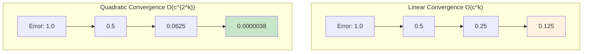
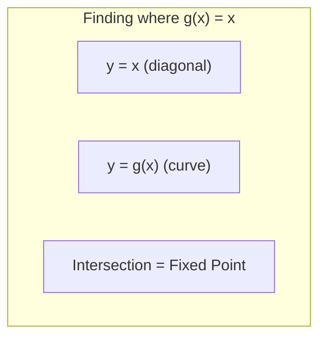

# Approximation Methods

## Intuition

Imagine you're trying to find the exact location of a treasure on an island. You don't have a map, but you have a compass that always points toward the treasure. You take a step in that direction, check the compass again, and repeat. Eventually, you get close enough to dig.

This is the essence of iterative approximation methods. We can't always solve problems exactly (like finding closed-form solutions), but we can get arbitrarily close by repeatedly improving our estimate. In machine learning, we use these methods constantly - training a neural network is nothing but iteratively approximating the optimal weights.

**Why this matters for ML:**
- Neural network training is an iterative approximation process
- Exact solutions are often impossible (no closed-form for deep learning loss functions)
- Understanding convergence helps you know when to stop training
- Different algorithms converge at different rates - choosing wisely saves compute

## Visual Explanation

### Iterative Refinement Process


### Convergence Visualization



### Fixed-Point Iteration Geometry



## Mathematical Foundation

### Fixed-Point Iteration

A **fixed point** of a function $g(x)$ is a value $x^*$ where:
$$g(x^*) = x^*$$

Fixed-point iteration generates a sequence:
$$x_{k+1} = g(x_k)$$

**Convergence Theorem**: If $|g'(x)| < 1$ in a neighborhood of $x^*$, then iteration converges.

The convergence rate is **linear** with rate $r = |g'(x^*)|$:
$$|x_{k+1} - x^*| \approx r \cdot |x_k - x^*|$$

### Newton's Method

For finding roots of $f(x) = 0$, Newton's method uses:
$$x_{k+1} = x_k - \frac{f(x_k)}{f'(x_k)}$$

This has **quadratic convergence** near the root:
$$|x_{k+1} - x^*| \leq C \cdot |x_k - x^*|^2$$

For optimization (finding minima of $h(x)$), we apply Newton's method to $h'(x) = 0$:
$$x_{k+1} = x_k - \frac{h'(x_k)}{h''(x_k)}$$

In multiple dimensions:
$$\mathbf{x}_{k+1} = \mathbf{x}_k - \mathbf{H}^{-1} \nabla h(\mathbf{x}_k)$$

where $\mathbf{H}$ is the Hessian matrix.

### Convergence Types

| Type | Definition | Error Reduction |
|------|------------|-----------------|
| Linear | $\|e_{k+1}\| \leq c\|e_k\|$ where $c < 1$ | Constant factor |
| Superlinear | $\|e_{k+1}\|/\|e_k\| \to 0$ | Accelerating |
| Quadratic | $\|e_{k+1}\| \leq c\|e_k\|^2$ | Errors square |

### Stopping Criteria

Common criteria for terminating iteration:

1. **Absolute tolerance**: $|x_{k+1} - x_k| < \epsilon_{\text{abs}}$
2. **Relative tolerance**: $|x_{k+1} - x_k| / |x_k| < \epsilon_{\text{rel}}$
3. **Function value**: $|f(x_k)| < \epsilon$
4. **Maximum iterations**: $k > k_{\text{max}}$

Robust implementations check multiple criteria:
$$\text{converged} = (|x_{k+1} - x_k| < \epsilon_{\text{abs}} + \epsilon_{\text{rel}} \cdot |x_k|)$$

## Code Example

```python
import numpy as np
import matplotlib.pyplot as plt
from typing import Callable, Tuple, List

# ============================================
# Part 1: Fixed-Point Iteration
# ============================================

def fixed_point_iteration(
    g: Callable[[float], float],
    x0: float,
    tol: float = 1e-10,
    max_iter: int = 100
) -> Tuple[float, List[float], bool]:
    """
    Find fixed point where g(x) = x.

    Returns:
        (solution, history, converged)
    """
    history = [x0]
    x = x0

    for i in range(max_iter):
        x_new = g(x)
        history.append(x_new)

        # Check convergence
        if abs(x_new - x) < tol:
            return x_new, history, True

        # Check for divergence
        if abs(x_new) > 1e10:
            return x_new, history, False

        x = x_new

    return x, history, False


print("=== Fixed-Point Iteration ===")

# Example 1: Find sqrt(2) by solving x = (x + 2/x) / 2
# This is the Babylonian method
g_sqrt = lambda x: (x + 2/x) / 2
x_star, history, converged = fixed_point_iteration(g_sqrt, x0=1.0)
print(f"Finding sqrt(2):")
print(f"  Solution: {x_star}")
print(f"  True value: {np.sqrt(2)}")
print(f"  Iterations: {len(history) - 1}")
print(f"  History: {[f'{x:.10f}' for x in history[:6]]}")

# Example 2: Find x where cos(x) = x
g_cos = lambda x: np.cos(x)
x_star, history, converged = fixed_point_iteration(g_cos, x0=0.5)
print(f"\nFinding fixed point of cos(x):")
print(f"  Solution: {x_star}")
print(f"  Verification cos(x*) = {np.cos(x_star)}")
print(f"  Iterations: {len(history) - 1}")


# ============================================
# Part 2: Newton's Method
# ============================================

def newton_method(
    f: Callable[[float], float],
    f_prime: Callable[[float], float],
    x0: float,
    tol: float = 1e-10,
    max_iter: int = 100
) -> Tuple[float, List[float], bool]:
    """
    Find root of f(x) = 0 using Newton's method.

    Returns:
        (solution, history, converged)
    """
    history = [x0]
    x = x0

    for i in range(max_iter):
        fx = f(x)
        fpx = f_prime(x)

        # Avoid division by zero
        if abs(fpx) < 1e-15:
            return x, history, False

        x_new = x - fx / fpx
        history.append(x_new)

        if abs(x_new - x) < tol:
            return x_new, history, True

        x = x_new

    return x, history, False


print("\n=== Newton's Method ===")

# Find root of x^2 - 2 = 0 (i.e., sqrt(2))
f = lambda x: x**2 - 2
f_prime = lambda x: 2*x

x_star, history, converged = newton_method(f, f_prime, x0=1.0)
print(f"Finding sqrt(2) via x^2 - 2 = 0:")
print(f"  Solution: {x_star}")
print(f"  Iterations: {len(history) - 1}")

# Show quadratic convergence
errors = [abs(x - np.sqrt(2)) for x in history]
print(f"  Errors: {[f'{e:.2e}' for e in errors]}")


# ============================================
# Part 3: Newton's Method for Optimization
# ============================================

def newton_optimization(
    f: Callable[[float], float],
    f_prime: Callable[[float], float],
    f_double_prime: Callable[[float], float],
    x0: float,
    tol: float = 1e-10,
    max_iter: int = 100
) -> Tuple[float, List[float], bool]:
    """
    Find minimum of f(x) using Newton's method on f'(x) = 0.
    """
    history = [x0]
    x = x0

    for i in range(max_iter):
        grad = f_prime(x)
        hess = f_double_prime(x)

        if abs(hess) < 1e-15:
            return x, history, False

        x_new = x - grad / hess
        history.append(x_new)

        if abs(x_new - x) < tol:
            return x_new, history, True

        x = x_new

    return x, history, False


print("\n=== Newton's Method for Optimization ===")

# Minimize f(x) = (x - 3)^4 + x^2
f = lambda x: (x - 3)**4 + x**2
f_prime = lambda x: 4*(x - 3)**3 + 2*x
f_double_prime = lambda x: 12*(x - 3)**2 + 2

x_min, history, converged = newton_optimization(f, f_prime, f_double_prime, x0=0.0)
print(f"Minimizing (x-3)^4 + x^2:")
print(f"  Minimum at: {x_min}")
print(f"  f(x_min) = {f(x_min)}")
print(f"  Iterations: {len(history) - 1}")


# ============================================
# Part 4: Gradient Descent vs Newton Comparison
# ============================================

def gradient_descent(
    f_prime: Callable[[float], float],
    x0: float,
    learning_rate: float = 0.01,
    tol: float = 1e-10,
    max_iter: int = 10000
) -> Tuple[float, List[float], bool]:
    """Simple gradient descent."""
    history = [x0]
    x = x0

    for i in range(max_iter):
        grad = f_prime(x)
        x_new = x - learning_rate * grad
        history.append(x_new)

        if abs(x_new - x) < tol:
            return x_new, history, True

        x = x_new

    return x, history, False


print("\n=== Gradient Descent vs Newton ===")

# Quadratic function: f(x) = x^2
f_prime = lambda x: 2*x
f_double_prime = lambda x: 2

# Newton's method
x_newton, hist_newton, _ = newton_optimization(
    lambda x: x**2, f_prime, f_double_prime, x0=10.0
)
print(f"Newton's method: {len(hist_newton) - 1} iterations")

# Gradient descent with various learning rates
for lr in [0.1, 0.5, 0.9]:
    x_gd, hist_gd, converged = gradient_descent(f_prime, x0=10.0, learning_rate=lr)
    status = "converged" if converged else "did not converge"
    print(f"GD (lr={lr}): {len(hist_gd) - 1} iterations, {status}")


# ============================================
# Part 5: Convergence Rate Analysis
# ============================================

def analyze_convergence(errors: List[float]) -> str:
    """Estimate convergence rate from error sequence."""
    if len(errors) < 3:
        return "insufficient data"

    # Filter out zeros
    errors = [e for e in errors if e > 1e-15]
    if len(errors) < 3:
        return "converged too quickly"

    # Estimate order of convergence
    # If e_{k+1} = C * e_k^p, then
    # log(e_{k+1}/e_{k+2}) / log(e_k/e_{k+1}) ≈ p
    ratios = []
    for i in range(len(errors) - 2):
        if errors[i+1] > 0 and errors[i+2] > 0 and errors[i] > errors[i+1]:
            r1 = errors[i] / errors[i+1]
            r2 = errors[i+1] / errors[i+2]
            if r1 > 1 and r2 > 1:
                p = np.log(r2) / np.log(r1)
                ratios.append(p)

    if not ratios:
        return "could not estimate"

    avg_p = np.mean(ratios)

    if avg_p < 1.2:
        return f"linear (p ≈ {avg_p:.2f})"
    elif avg_p < 1.8:
        return f"superlinear (p ≈ {avg_p:.2f})"
    else:
        return f"quadratic (p ≈ {avg_p:.2f})"


print("\n=== Convergence Rate Analysis ===")

# Fixed-point iteration (linear convergence)
g = lambda x: np.cos(x)
_, history, _ = fixed_point_iteration(g, x0=0.5, tol=1e-15)
x_star = history[-1]
errors = [abs(x - x_star) for x in history[:-1]]
print(f"Fixed-point (cos): {analyze_convergence(errors)}")

# Newton's method (quadratic convergence)
f = lambda x: x**2 - 2
fp = lambda x: 2*x
_, history, _ = newton_method(f, fp, x0=1.0, tol=1e-15)
errors = [abs(x - np.sqrt(2)) for x in history]
print(f"Newton (sqrt(2)): {analyze_convergence(errors)}")


# ============================================
# Part 6: Multi-dimensional Newton for ML
# ============================================

def multivariate_newton(
    grad_f: Callable[[np.ndarray], np.ndarray],
    hessian_f: Callable[[np.ndarray], np.ndarray],
    x0: np.ndarray,
    tol: float = 1e-10,
    max_iter: int = 100
) -> Tuple[np.ndarray, List[np.ndarray], bool]:
    """
    Newton's method for multivariate optimization.
    """
    history = [x0.copy()]
    x = x0.copy()

    for i in range(max_iter):
        g = grad_f(x)
        H = hessian_f(x)

        try:
            # Solve H @ delta = -g for delta
            delta = np.linalg.solve(H, -g)
        except np.linalg.LinAlgError:
            return x, history, False

        x_new = x + delta
        history.append(x_new.copy())

        if np.linalg.norm(delta) < tol:
            return x_new, history, True

        x = x_new

    return x, history, False


print("\n=== Multivariate Newton ===")

# Minimize Rosenbrock function (a classic test function)
# f(x,y) = (1-x)^2 + 100(y-x^2)^2

def rosenbrock_grad(xy):
    x, y = xy
    dx = -2*(1-x) - 400*x*(y - x**2)
    dy = 200*(y - x**2)
    return np.array([dx, dy])

def rosenbrock_hessian(xy):
    x, y = xy
    H = np.array([
        [2 - 400*(y - 3*x**2), -400*x],
        [-400*x, 200]
    ])
    return H

x0 = np.array([0.0, 0.0])
x_min, history, converged = multivariate_newton(
    rosenbrock_grad, rosenbrock_hessian, x0, tol=1e-8
)
print(f"Rosenbrock minimum (Newton):")
print(f"  Solution: {x_min}")
print(f"  True minimum: [1, 1]")
print(f"  Iterations: {len(history) - 1}")


# ============================================
# Part 7: When Newton Fails
# ============================================

print("\n=== When Newton Fails ===")

# Example 1: Division by zero (f'(x) = 0)
f = lambda x: x**3
f_prime = lambda x: 3*x**2

x_star, history, converged = newton_method(f, f_prime, x0=0.1)
print(f"f(x) = x^3, starting at x0=0.1:")
print(f"  Converged: {converged}")
print(f"  Iterations: {len(history) - 1}")

# Example 2: Cycling
f = lambda x: x**3 - 2*x + 2
f_prime = lambda x: 3*x**2 - 2

x_star, history, converged = newton_method(f, f_prime, x0=0.0, max_iter=20)
print(f"\nf(x) = x^3 - 2x + 2, starting at x0=0:")
print(f"  May cycle. Final x = {history[-1]:.6f}")
print(f"  History: {[f'{x:.4f}' for x in history[:10]]}")
```

## ML Relevance

### Where Approximation Methods Appear

1. **Neural Network Training**: The entire training process is iterative approximation
   - We iteratively update weights to approximate the optimal solution
   - Convergence is measured by loss decrease over epochs

2. **Expectation-Maximization (EM)**: Finding maximum likelihood estimates
   - E-step: Compute expected values
   - M-step: Maximize parameters
   - Iterates until convergence

3. **Power Iteration**: Finding dominant eigenvector
   - Used in PageRank, PCA
   - Linear convergence rate

4. **Iterative Solvers**: For large linear systems
   - Conjugate gradient method
   - Used in kernel methods, Gaussian processes

5. **Quasi-Newton Methods**: BFGS, L-BFGS
   - Approximate Hessian without computing it
   - Superlinear convergence, practical for large-scale ML

### Connection to Training Dynamics

```python
# Training loop is iterative approximation
def training_as_approximation(model, data, epochs):
    """Neural network training is fixed-point iteration on parameters."""
    # We're finding theta* such that:
    # theta* = theta* - lr * gradient(loss(theta*))
    # i.e., gradient(loss(theta*)) = 0

    for epoch in range(epochs):
        for x, y in data:
            loss = compute_loss(model(x), y)
            gradients = compute_gradients(loss)
            # Fixed-point iteration step
            model.parameters -= learning_rate * gradients

        # Check convergence
        if loss < tolerance:
            break
```

## When to Use / Ignore

### When to Use Iterative Methods

- **No closed-form solution**: Most ML optimization problems
- **Large-scale problems**: Direct methods (matrix inversion) too expensive
- **Approximate solutions acceptable**: We don't need exact gradients
- **Online/streaming data**: Can't solve in one pass

### Choosing the Right Method

| Method | Use When | Convergence |
|--------|----------|-------------|
| Gradient Descent | Simple, need robustness | Linear |
| Newton | Small problems, need speed | Quadratic |
| Quasi-Newton (L-BFGS) | Medium problems | Superlinear |
| Stochastic GD | Large datasets | Sublinear (noisy) |

### Common Pitfalls

1. **Forgetting convergence checks**: Always monitor loss/gradient norm
2. **Fixed iteration count**: Different problems need different iterations
3. **Ignoring divergence**: If loss increases, something is wrong
4. **Too tight tolerance**: Sometimes "good enough" is good enough
5. **Not considering cost per iteration**: Newton is O(n^3) per step

## Exercises

### Exercise 1: Implement Secant Method

**Problem**: Implement the secant method, which approximates Newton's method without requiring derivatives.

$$x_{k+1} = x_k - f(x_k) \frac{x_k - x_{k-1}}{f(x_k) - f(x_{k-1})}$$

**Solution**:
```python
def secant_method(
    f: Callable[[float], float],
    x0: float,
    x1: float,
    tol: float = 1e-10,
    max_iter: int = 100
) -> Tuple[float, List[float], bool]:
    """
    Secant method: Newton without derivatives.

    Convergence rate: superlinear (golden ratio ≈ 1.618)
    """
    history = [x0, x1]

    for i in range(max_iter):
        f0, f1 = f(x0), f(x1)

        # Avoid division by zero
        if abs(f1 - f0) < 1e-15:
            return x1, history, abs(f1) < tol

        x_new = x1 - f1 * (x1 - x0) / (f1 - f0)
        history.append(x_new)

        if abs(x_new - x1) < tol:
            return x_new, history, True

        x0, x1 = x1, x_new

    return x1, history, False

# Test: find sqrt(2)
f = lambda x: x**2 - 2
x_star, history, converged = secant_method(f, 1.0, 2.0)
print(f"Secant method for sqrt(2):")
print(f"  Solution: {x_star}")
print(f"  Iterations: {len(history) - 2}")
print(f"  Errors: {[f'{abs(x - np.sqrt(2)):.2e}' for x in history]}")
```

### Exercise 2: Early Stopping Detection

**Problem**: Implement a convergence monitor that detects when to stop training early.

**Solution**:
```python
class ConvergenceMonitor:
    """
    Monitor loss trajectory and detect convergence/divergence.
    """
    def __init__(self, patience: int = 10, min_delta: float = 1e-4):
        self.patience = patience
        self.min_delta = min_delta
        self.history = []
        self.best_loss = float('inf')
        self.counter = 0

    def update(self, loss: float) -> str:
        """
        Update monitor with new loss value.

        Returns: 'continue', 'converged', or 'diverged'
        """
        self.history.append(loss)

        # Check for divergence (loss exploding)
        if loss > 1e10 or np.isnan(loss):
            return 'diverged'

        # Check for improvement
        if loss < self.best_loss - self.min_delta:
            self.best_loss = loss
            self.counter = 0
        else:
            self.counter += 1

        # Check for convergence (no improvement for `patience` steps)
        if self.counter >= self.patience:
            return 'converged'

        return 'continue'

    def convergence_rate(self) -> float:
        """Estimate convergence rate from recent history."""
        if len(self.history) < 5:
            return 0.0

        recent = self.history[-10:]
        ratios = []
        for i in range(len(recent) - 1):
            if recent[i] > 0:
                ratios.append(recent[i+1] / recent[i])

        return np.mean(ratios) if ratios else 1.0

# Simulate training
monitor = ConvergenceMonitor(patience=5)
losses = [1.0, 0.5, 0.3, 0.2, 0.15, 0.12, 0.11, 0.108, 0.107, 0.1065]

for epoch, loss in enumerate(losses):
    status = monitor.update(loss)
    print(f"Epoch {epoch}: loss={loss:.4f}, status={status}")

print(f"Convergence rate: {monitor.convergence_rate():.4f}")
```

### Exercise 3: Compare Convergence Rates

**Problem**: Empirically compare convergence rates of fixed-point iteration, Newton's method, and secant method on finding the cube root of 2.

**Solution**:
```python
import numpy as np

def compare_convergence():
    """Compare methods for finding cube root of 2."""
    target = 2 ** (1/3)

    # Fixed-point: x = (2x + 2/x^2) / 3
    g = lambda x: (2*x + 2/x**2) / 3

    # Newton: f(x) = x^3 - 2
    f = lambda x: x**3 - 2
    fp = lambda x: 3*x**2

    print("Finding cube root of 2:")
    print(f"True value: {target}\n")

    # Fixed-point iteration
    x = 1.0
    print("Fixed-point iteration:")
    for i in range(10):
        error = abs(x - target)
        print(f"  Iter {i}: x = {x:.10f}, error = {error:.2e}")
        x = g(x)

    # Newton's method
    x = 1.0
    print("\nNewton's method:")
    for i in range(6):
        error = abs(x - target)
        print(f"  Iter {i}: x = {x:.10f}, error = {error:.2e}")
        x = x - f(x) / fp(x)

    # Secant method
    x0, x1 = 1.0, 1.5
    print("\nSecant method:")
    for i in range(8):
        error = abs(x1 - target)
        print(f"  Iter {i}: x = {x1:.10f}, error = {error:.2e}")
        x_new = x1 - f(x1) * (x1 - x0) / (f(x1) - f(x0))
        x0, x1 = x1, x_new

compare_convergence()
```

## Summary

- **Fixed-point iteration** finds $x$ where $g(x) = x$; converges linearly when $|g'(x^*)| < 1$
- **Newton's method** has **quadratic convergence** but requires computing derivatives
- **Secant method** achieves **superlinear convergence** ($p \approx 1.618$) without derivatives
- **Convergence rate matters**: Quadratic convergence doubles correct digits each iteration
- **Stopping criteria** should combine absolute tolerance, relative tolerance, and iteration limits
- **Newton's method can fail** with bad starting points, zero derivatives, or saddle points
- **Neural network training** is iterative approximation with typically linear convergence
- **Choose methods wisely**: Faster convergence per iteration vs. cost per iteration
- **Always monitor convergence**: Divergence or stagnation indicates problems with the method or parameters
