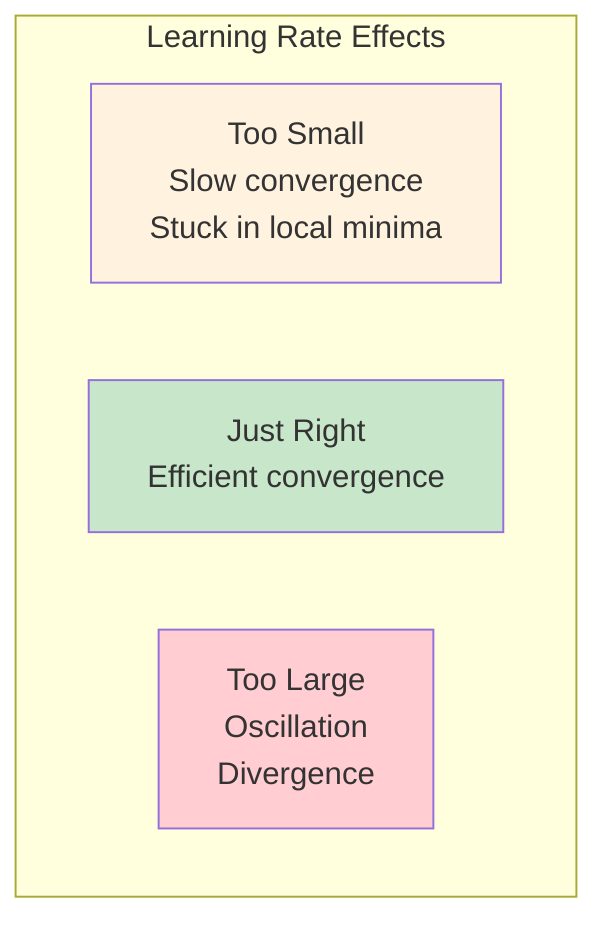
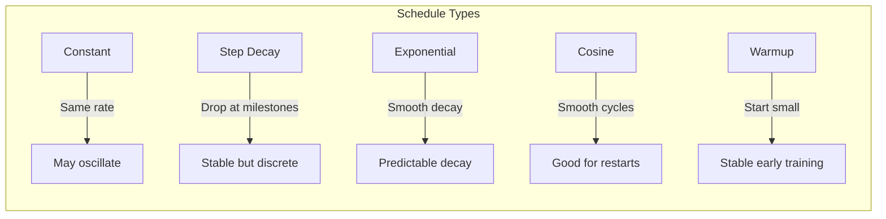

# Optimization in Practice

## Intuition

Imagine you're hiking down a mountain in thick fog. You can only feel the slope directly beneath your feet. Taking huge steps might send you tumbling off a cliff, while tiny steps mean you'll never reach the valley before nightfall. The optimal strategy? Start with cautious steps to get your bearings, then stride confidently as the terrain becomes familiar, and slow down again as you approach the valley floor.

This is exactly the challenge of learning rate scheduling in neural network optimization. The learning rate controls your step size, and the terrain is your loss landscape. Too large and you overshoot minima; too small and training takes forever or gets stuck.

**Why this matters for ML:**
- Learning rate is the most important hyperparameter in deep learning
- Wrong learning rate = wasted GPU hours or failed training
- Gradients in deep networks can explode or vanish, requiring clipping
- Production models use sophisticated schedules that adapt during training

## Visual Explanation

### Learning Rate Effects



### Learning Rate Schedule Comparison



### Gradient Clipping Visualization

```mermaid
graph TD
    G[Gradient g] --> C{|g| > threshold?}
    C -->|No| N[Use g as-is]
    C -->|Yes| Y[Scale g down]
    Y --> R[g * threshold / |g|]

    style G fill:#e1f5fe
    style R fill:#c8e6c9
    style N fill:#c8e6c9
```

## Mathematical Foundation

### Learning Rate Schedules

#### Step Decay
$$\eta_t = \eta_0 \cdot \gamma^{\lfloor t / s \rfloor}$$

where $\eta_0$ is initial learning rate, $\gamma$ is decay factor (e.g., 0.1), $s$ is step size in epochs.

#### Exponential Decay
$$\eta_t = \eta_0 \cdot e^{-\lambda t}$$

or equivalently:
$$\eta_t = \eta_0 \cdot \gamma^t$$

#### Cosine Annealing
$$\eta_t = \eta_{\min} + \frac{1}{2}(\eta_{\max} - \eta_{\min})\left(1 + \cos\left(\frac{t}{T}\pi\right)\right)$$

This smoothly decreases from $\eta_{\max}$ to $\eta_{\min}$ over $T$ iterations.

#### Warmup
For the first $T_w$ steps:
$$\eta_t = \eta_{\text{target}} \cdot \frac{t}{T_w}$$

After warmup, any schedule can be applied.

#### Cyclical Learning Rates
$$\eta_t = \eta_{\min} + (\eta_{\max} - \eta_{\min}) \cdot \text{triangular}(t)$$

Cycles between min and max, helping escape local minima.

### Gradient Clipping

#### Clipping by Value
$$g_i^{\text{clipped}} = \max(\min(g_i, \theta), -\theta)$$

Each gradient component is clipped independently.

#### Clipping by Norm (Preferred)
$$g^{\text{clipped}} = g \cdot \min\left(1, \frac{\theta}{\|g\|}\right)$$

If $\|g\| > \theta$:
$$g^{\text{clipped}} = \frac{\theta}{\|g\|} \cdot g$$

This preserves gradient direction while limiting magnitude.

#### Adaptive Gradient Clipping (AGC)
From NFNet paper:
$$g^{\text{clipped}} = g \cdot \min\left(1, \frac{\lambda \|W\|}{\|g\|}\right)$$

Clips based on parameter magnitude, not a fixed threshold.

### Why Clipping Works

For a loss function $L(\theta)$, the update is:
$$\theta_{t+1} = \theta_t - \eta \cdot g_t$$

With exploding gradients ($\|g_t\| \to \infty$), the update becomes unstable.
Clipping ensures:
$$\|\Delta\theta\| = \eta \cdot \|g^{\text{clipped}}\| \leq \eta \cdot \theta$$

## Code Example

```python
import numpy as np
import matplotlib.pyplot as plt
from typing import Callable, List, Tuple

# ============================================
# Part 1: Learning Rate Schedulers
# ============================================

class LRScheduler:
    """Base class for learning rate schedulers."""
    def __init__(self, initial_lr: float):
        self.initial_lr = initial_lr
        self.current_step = 0

    def get_lr(self) -> float:
        raise NotImplementedError

    def step(self):
        self.current_step += 1


class ConstantLR(LRScheduler):
    """Constant learning rate."""
    def get_lr(self) -> float:
        return self.initial_lr


class StepDecayLR(LRScheduler):
    """Step decay: multiply by gamma every step_size epochs."""
    def __init__(self, initial_lr: float, step_size: int = 30, gamma: float = 0.1):
        super().__init__(initial_lr)
        self.step_size = step_size
        self.gamma = gamma

    def get_lr(self) -> float:
        return self.initial_lr * (self.gamma ** (self.current_step // self.step_size))


class ExponentialDecayLR(LRScheduler):
    """Exponential decay: lr = initial_lr * gamma^step."""
    def __init__(self, initial_lr: float, gamma: float = 0.99):
        super().__init__(initial_lr)
        self.gamma = gamma

    def get_lr(self) -> float:
        return self.initial_lr * (self.gamma ** self.current_step)


class CosineAnnealingLR(LRScheduler):
    """Cosine annealing from max_lr to min_lr over T_max steps."""
    def __init__(self, initial_lr: float, T_max: int = 100, min_lr: float = 0):
        super().__init__(initial_lr)
        self.T_max = T_max
        self.min_lr = min_lr

    def get_lr(self) -> float:
        return self.min_lr + 0.5 * (self.initial_lr - self.min_lr) * \
               (1 + np.cos(np.pi * self.current_step / self.T_max))


class WarmupScheduler(LRScheduler):
    """Linear warmup followed by another scheduler."""
    def __init__(self, base_scheduler: LRScheduler, warmup_steps: int):
        super().__init__(base_scheduler.initial_lr)
        self.base_scheduler = base_scheduler
        self.warmup_steps = warmup_steps

    def get_lr(self) -> float:
        if self.current_step < self.warmup_steps:
            # Linear warmup
            return self.initial_lr * (self.current_step + 1) / self.warmup_steps
        else:
            # After warmup, use base scheduler
            self.base_scheduler.current_step = self.current_step - self.warmup_steps
            return self.base_scheduler.get_lr()


class CyclicLR(LRScheduler):
    """Cyclical learning rate with triangular pattern."""
    def __init__(self, initial_lr: float, max_lr: float, step_size: int = 50):
        super().__init__(initial_lr)
        self.max_lr = max_lr
        self.step_size = step_size

    def get_lr(self) -> float:
        cycle = np.floor(1 + self.current_step / (2 * self.step_size))
        x = abs(self.current_step / self.step_size - 2 * cycle + 1)
        return self.initial_lr + (self.max_lr - self.initial_lr) * max(0, 1 - x)


# Visualize schedules
print("=== Learning Rate Schedules ===")

schedulers = {
    'Constant': ConstantLR(0.1),
    'Step Decay': StepDecayLR(0.1, step_size=30, gamma=0.1),
    'Exponential': ExponentialDecayLR(0.1, gamma=0.97),
    'Cosine': CosineAnnealingLR(0.1, T_max=100),
    'Warmup + Cosine': WarmupScheduler(CosineAnnealingLR(0.1, T_max=90), warmup_steps=10),
    'Cyclic': CyclicLR(0.01, max_lr=0.1, step_size=25)
}

steps = 100
for name, scheduler in schedulers.items():
    lrs = []
    for _ in range(steps):
        lrs.append(scheduler.get_lr())
        scheduler.step()
    print(f"{name}: start={lrs[0]:.4f}, end={lrs[-1]:.4f}, min={min(lrs):.4f}, max={max(lrs):.4f}")


# ============================================
# Part 2: Gradient Clipping Implementations
# ============================================

def clip_by_value(gradients: np.ndarray, clip_value: float) -> np.ndarray:
    """
    Clip each gradient component to [-clip_value, clip_value].
    Simple but can change gradient direction.
    """
    return np.clip(gradients, -clip_value, clip_value)


def clip_by_norm(gradients: np.ndarray, max_norm: float) -> np.ndarray:
    """
    Scale gradients if their L2 norm exceeds max_norm.
    Preserves gradient direction.
    """
    norm = np.linalg.norm(gradients)
    if norm > max_norm:
        return gradients * (max_norm / norm)
    return gradients


def clip_by_global_norm(gradient_list: List[np.ndarray], max_norm: float) -> List[np.ndarray]:
    """
    Clip by global norm across all gradient tensors.
    Used when gradients are split across multiple parameters.
    """
    global_norm = np.sqrt(sum(np.sum(g**2) for g in gradient_list))

    if global_norm > max_norm:
        scale = max_norm / global_norm
        return [g * scale for g in gradient_list]
    return gradient_list


def adaptive_gradient_clip(
    gradients: np.ndarray,
    weights: np.ndarray,
    clip_factor: float = 0.01
) -> np.ndarray:
    """
    Adaptive Gradient Clipping (AGC) from NFNet paper.
    Clips based on ratio of gradient norm to weight norm.
    """
    weight_norm = np.linalg.norm(weights)
    grad_norm = np.linalg.norm(gradients)

    max_grad_norm = clip_factor * weight_norm

    if grad_norm > max_grad_norm and grad_norm > 0:
        return gradients * (max_grad_norm / grad_norm)
    return gradients


print("\n=== Gradient Clipping ===")

# Example: Exploding gradient scenario
np.random.seed(42)
exploding_grad = np.array([100.0, -200.0, 150.0])

print(f"Original gradient: {exploding_grad}")
print(f"Original norm: {np.linalg.norm(exploding_grad):.2f}")

# Clip by value
clipped_value = clip_by_value(exploding_grad, clip_value=50.0)
print(f"\nClip by value (50):")
print(f"  Result: {clipped_value}")
print(f"  Norm: {np.linalg.norm(clipped_value):.2f}")
print(f"  Direction preserved: {np.allclose(exploding_grad/np.linalg.norm(exploding_grad), clipped_value/np.linalg.norm(clipped_value))}")

# Clip by norm
clipped_norm = clip_by_norm(exploding_grad, max_norm=50.0)
print(f"\nClip by norm (50):")
print(f"  Result: {clipped_norm}")
print(f"  Norm: {np.linalg.norm(clipped_norm):.2f}")
print(f"  Direction preserved: {np.allclose(exploding_grad/np.linalg.norm(exploding_grad), clipped_norm/np.linalg.norm(clipped_norm))}")


# ============================================
# Part 3: Complete Training Loop with Scheduling and Clipping
# ============================================

def rosenbrock(xy: np.ndarray) -> float:
    """Rosenbrock function: f(x,y) = (1-x)^2 + 100(y-x^2)^2"""
    x, y = xy
    return (1 - x)**2 + 100 * (y - x**2)**2


def rosenbrock_grad(xy: np.ndarray) -> np.ndarray:
    """Gradient of Rosenbrock function."""
    x, y = xy
    dx = -2 * (1 - x) - 400 * x * (y - x**2)
    dy = 200 * (y - x**2)
    return np.array([dx, dy])


def train_with_schedule(
    x0: np.ndarray,
    scheduler: LRScheduler,
    max_steps: int = 500,
    clip_norm: float = None
) -> Tuple[np.ndarray, List[float]]:
    """
    Train using gradient descent with learning rate schedule and optional clipping.
    """
    x = x0.copy()
    losses = []

    for step in range(max_steps):
        loss = rosenbrock(x)
        losses.append(loss)

        grad = rosenbrock_grad(x)

        # Apply gradient clipping if specified
        if clip_norm is not None:
            grad = clip_by_norm(grad, clip_norm)

        lr = scheduler.get_lr()
        x = x - lr * grad
        scheduler.step()

        # Early stopping if converged
        if loss < 1e-10:
            break

    return x, losses


print("\n=== Training with Different Schedules ===")

x0 = np.array([-1.0, 1.0])

# Test different configurations
configs = [
    ('Constant (lr=0.001)', ConstantLR(0.001), None),
    ('Constant (lr=0.01)', ConstantLR(0.01), None),
    ('Step Decay', StepDecayLR(0.01, step_size=100, gamma=0.5), None),
    ('Cosine', CosineAnnealingLR(0.01, T_max=500, min_lr=0.0001), None),
    ('Warmup + Cosine', WarmupScheduler(CosineAnnealingLR(0.01, T_max=480), warmup_steps=20), None),
    ('Constant + Clipping', ConstantLR(0.01), 1.0),
]

for name, scheduler, clip_norm in configs:
    # Reset scheduler
    scheduler.current_step = 0
    if hasattr(scheduler, 'base_scheduler'):
        scheduler.base_scheduler.current_step = 0

    x_final, losses = train_with_schedule(x0.copy(), scheduler, max_steps=500, clip_norm=clip_norm)
    final_loss = losses[-1]
    print(f"{name}:")
    print(f"  Final position: [{x_final[0]:.4f}, {x_final[1]:.4f}]")
    print(f"  Final loss: {final_loss:.6f}")
    print(f"  Steps to converge: {len(losses)}")


# ============================================
# Part 4: Demonstrating Gradient Explosion
# ============================================

print("\n=== Gradient Explosion Demo ===")

def simulate_deep_network_gradients(
    depth: int,
    weight_scale: float = 1.5
) -> List[float]:
    """
    Simulate gradient flow through a deep network.
    Gradients are multiplied by weight_scale at each layer.
    """
    grad = 1.0
    gradients = [grad]

    for layer in range(depth):
        grad = grad * weight_scale
        gradients.append(grad)

    return gradients


# Without clipping
depth = 50
gradients_exploding = simulate_deep_network_gradients(depth, weight_scale=1.1)
print(f"Gradients with scale 1.1 over {depth} layers:")
print(f"  Initial: {gradients_exploding[0]:.2f}")
print(f"  Final: {gradients_exploding[-1]:.2e}")

# With per-layer clipping
def simulate_with_clipping(depth: int, weight_scale: float, clip_value: float) -> List[float]:
    grad = 1.0
    gradients = [grad]

    for layer in range(depth):
        grad = grad * weight_scale
        grad = min(grad, clip_value)  # Clip
        gradients.append(grad)

    return gradients


gradients_clipped = simulate_with_clipping(depth, weight_scale=1.1, clip_value=10.0)
print(f"\nWith gradient clipping (clip=10):")
print(f"  Initial: {gradients_clipped[0]:.2f}")
print(f"  Final: {gradients_clipped[-1]:.2f}")


# ============================================
# Part 5: Finding Optimal Learning Rate
# ============================================

print("\n=== Learning Rate Range Test ===")

def lr_range_test(
    x0: np.ndarray,
    min_lr: float = 1e-6,
    max_lr: float = 1.0,
    num_steps: int = 100
) -> Tuple[List[float], List[float]]:
    """
    Learning rate range test to find optimal learning rate.
    Gradually increase LR and track loss.
    """
    x = x0.copy()
    lrs = []
    losses = []

    # Exponentially increase learning rate
    lr_mult = (max_lr / min_lr) ** (1 / num_steps)
    lr = min_lr

    for step in range(num_steps):
        loss = rosenbrock(x)
        lrs.append(lr)
        losses.append(loss)

        grad = rosenbrock_grad(x)
        grad = clip_by_norm(grad, 10.0)  # Prevent explosion

        x = x - lr * grad
        lr *= lr_mult

        # Stop if loss explodes
        if loss > 1e10 or np.isnan(loss):
            break

    return lrs, losses


lrs, losses = lr_range_test(np.array([-1.0, 1.0]))

# Find the steepest decrease
best_idx = 0
best_decrease = 0
for i in range(1, len(losses) - 1):
    decrease = losses[i-1] - losses[i+1]
    if decrease > best_decrease:
        best_decrease = decrease
        best_idx = i

print(f"Learning rate range test results:")
print(f"  Best LR region: {lrs[best_idx]:.4f}")
print(f"  Recommended LR: {lrs[best_idx] / 10:.4f} to {lrs[best_idx]:.4f}")


# ============================================
# Part 6: One-Cycle Policy
# ============================================

class OneCycleLR(LRScheduler):
    """
    One-cycle learning rate policy.
    1. Warmup: lr increases from min to max
    2. Annealing: lr decreases from max to min
    """
    def __init__(
        self,
        max_lr: float,
        total_steps: int,
        pct_start: float = 0.3,
        div_factor: float = 25.0,
        final_div_factor: float = 1000.0
    ):
        self.max_lr = max_lr
        self.min_lr = max_lr / div_factor
        self.final_lr = max_lr / final_div_factor
        self.total_steps = total_steps
        self.pct_start = pct_start
        self.warmup_steps = int(total_steps * pct_start)
        super().__init__(self.min_lr)

    def get_lr(self) -> float:
        if self.current_step < self.warmup_steps:
            # Warmup phase: linear increase
            progress = self.current_step / self.warmup_steps
            return self.min_lr + progress * (self.max_lr - self.min_lr)
        else:
            # Annealing phase: cosine decrease
            progress = (self.current_step - self.warmup_steps) / (self.total_steps - self.warmup_steps)
            return self.final_lr + 0.5 * (self.max_lr - self.final_lr) * (1 + np.cos(np.pi * progress))


print("\n=== One-Cycle Policy ===")

one_cycle = OneCycleLR(max_lr=0.1, total_steps=100)
lrs = []
for _ in range(100):
    lrs.append(one_cycle.get_lr())
    one_cycle.step()

print(f"One-cycle schedule:")
print(f"  Start: {lrs[0]:.4f}")
print(f"  Peak (at ~30%): {max(lrs):.4f}")
print(f"  End: {lrs[-1]:.6f}")
```

## ML Relevance

### Where Learning Rate Scheduling Appears

1. **Image Classification**: Step decay at specific epochs (ResNet uses [30, 60, 90])
2. **NLP Transformers**: Linear warmup + cosine/linear decay
3. **Reinforcement Learning**: Often constant or slowly decaying
4. **GANs**: Careful scheduling to maintain generator-discriminator balance
5. **Transfer Learning**: Different LRs for pretrained vs. new layers

### Framework Implementations

```python
# PyTorch schedulers
import torch.optim as optim
from torch.optim.lr_scheduler import (
    StepLR,
    ExponentialLR,
    CosineAnnealingLR,
    OneCycleLR,
    ReduceLROnPlateau
)

# Example usage
optimizer = optim.SGD(model.parameters(), lr=0.1)

# Step decay
scheduler = StepLR(optimizer, step_size=30, gamma=0.1)

# Cosine annealing
scheduler = CosineAnnealingLR(optimizer, T_max=100)

# One-cycle (super-convergence)
scheduler = OneCycleLR(optimizer, max_lr=0.1, total_steps=1000)

# Adaptive (reduce on plateau)
scheduler = ReduceLROnPlateau(optimizer, mode='min', patience=10)

# Training loop
for epoch in range(epochs):
    train()
    scheduler.step()  # Update learning rate
```

### Where Gradient Clipping Appears

1. **RNNs/LSTMs**: Essential for sequence models
2. **Transformers**: Standard practice (typically clip_norm=1.0)
3. **Deep ResNets**: Helps with very deep architectures
4. **Reinforcement Learning**: Policy gradients can be unstable

```python
# PyTorch gradient clipping
import torch.nn.utils as utils

# Clip by norm (recommended)
utils.clip_grad_norm_(model.parameters(), max_norm=1.0)

# Clip by value
utils.clip_grad_value_(model.parameters(), clip_value=0.5)
```

## When to Use / Ignore

### Learning Rate Schedule Guidelines

| Situation | Recommended Schedule |
|-----------|---------------------|
| Quick experiments | Constant with good default |
| Standard training | Step decay or cosine annealing |
| Transformers | Warmup + linear/cosine decay |
| Limited compute | One-cycle policy |
| Unknown optimal LR | Learning rate range test first |
| Fine-tuning | Lower LR, possibly discriminative LRs |

### Gradient Clipping Guidelines

| Situation | Recommendation |
|-----------|---------------|
| RNNs | Always use (clip_norm=1-5) |
| Transformers | Use (clip_norm=1.0 is standard) |
| CNNs | Often not needed with BatchNorm |
| Exploding gradients | Increase clipping aggressively |
| Training instability | Try clipping before reducing LR |

### Common Pitfalls

1. **Learning rate too high**: Diverging loss, NaN values
2. **Learning rate too low**: Training takes forever, stuck in suboptimal minima
3. **No warmup with Adam**: Can cause instability in early training
4. **Too aggressive clipping**: Slows down training significantly
5. **Forgetting to call scheduler.step()**: LR never changes
6. **Clipping before accumulating gradients**: Wrong effective gradient

## Exercises

### Exercise 1: Implement Reduce on Plateau

**Problem**: Implement a scheduler that reduces LR when loss stops improving.

**Solution**:
```python
class ReduceOnPlateau:
    """
    Reduce learning rate when a metric has stopped improving.
    """
    def __init__(
        self,
        initial_lr: float,
        factor: float = 0.1,
        patience: int = 10,
        min_lr: float = 1e-6
    ):
        self.lr = initial_lr
        self.factor = factor
        self.patience = patience
        self.min_lr = min_lr
        self.best_loss = float('inf')
        self.counter = 0

    def get_lr(self) -> float:
        return self.lr

    def step(self, loss: float):
        """Call with current loss value."""
        if loss < self.best_loss:
            self.best_loss = loss
            self.counter = 0
        else:
            self.counter += 1

            if self.counter >= self.patience:
                self.lr = max(self.lr * self.factor, self.min_lr)
                self.counter = 0
                print(f"Reducing LR to {self.lr:.6f}")


# Test
scheduler = ReduceOnPlateau(initial_lr=0.1, patience=3)

# Simulate training losses
losses = [1.0, 0.9, 0.85, 0.84, 0.84, 0.84, 0.84, 0.75, 0.74, 0.74, 0.74, 0.74]

for epoch, loss in enumerate(losses):
    lr = scheduler.get_lr()
    print(f"Epoch {epoch}: loss={loss:.2f}, lr={lr:.6f}")
    scheduler.step(loss)
```

### Exercise 2: Compare Clipping Strategies

**Problem**: Compare clip-by-value vs clip-by-norm on a training problem with exploding gradients.

**Solution**:
```python
def compare_clipping():
    """Compare clipping strategies on unstable optimization."""
    np.random.seed(42)

    # Difficult optimization landscape
    def loss_fn(x):
        return np.sum(x**4 - 16*x**2 + 5*x) / 2

    def grad_fn(x):
        return 2*x**3 - 16*x + 2.5

    x0 = np.array([5.0, -5.0, 3.0])

    def train(clip_fn, name, steps=100):
        x = x0.copy()
        losses = []
        lr = 0.01

        for step in range(steps):
            loss = loss_fn(x)
            losses.append(loss)

            grad = grad_fn(x)

            # Apply clipping
            grad = clip_fn(grad)

            x = x - lr * grad

            if np.any(np.isnan(x)) or np.any(np.abs(x) > 1e10):
                print(f"{name}: Diverged at step {step}")
                return losses

        return losses

    # No clipping
    losses_none = train(lambda g: g, "No clipping")

    # Clip by value
    losses_value = train(lambda g: np.clip(g, -10, 10), "Clip by value")

    # Clip by norm
    losses_norm = train(lambda g: clip_by_norm(g, 10), "Clip by norm")

    print("\nFinal losses:")
    print(f"  No clipping: {losses_none[-1] if losses_none else 'diverged':.4f}")
    print(f"  Clip by value: {losses_value[-1]:.4f}")
    print(f"  Clip by norm: {losses_norm[-1]:.4f}")


compare_clipping()
```

### Exercise 3: Implement Warmup + Cosine with Restarts

**Problem**: Implement cosine annealing with warm restarts (SGDR).

**Solution**:
```python
class CosineAnnealingWarmRestarts:
    """
    Cosine annealing with warm restarts.
    After T_0 epochs, restart with T_mult times longer period.
    """
    def __init__(
        self,
        initial_lr: float,
        T_0: int = 10,
        T_mult: int = 2,
        min_lr: float = 0
    ):
        self.initial_lr = initial_lr
        self.min_lr = min_lr
        self.T_0 = T_0
        self.T_mult = T_mult
        self.current_step = 0
        self.T_cur = 0  # Steps since last restart
        self.T_i = T_0  # Current period length

    def get_lr(self) -> float:
        return self.min_lr + 0.5 * (self.initial_lr - self.min_lr) * \
               (1 + np.cos(np.pi * self.T_cur / self.T_i))

    def step(self):
        self.T_cur += 1
        self.current_step += 1

        # Check for restart
        if self.T_cur >= self.T_i:
            self.T_cur = 0
            self.T_i = self.T_i * self.T_mult


# Test
scheduler = CosineAnnealingWarmRestarts(initial_lr=0.1, T_0=10, T_mult=2)

lrs = []
for step in range(70):
    lrs.append(scheduler.get_lr())
    scheduler.step()

# Show restart points
print("Cosine annealing with warm restarts:")
print(f"  First restart at step 10: LR jumps from {lrs[9]:.4f} to {lrs[10]:.4f}")
print(f"  Second restart at step 30: LR jumps from {lrs[29]:.4f} to {lrs[30]:.4f}")

# Verify pattern
restarts = [i for i in range(1, len(lrs)) if lrs[i] > lrs[i-1] + 0.01]
print(f"  Restarts occurred at steps: {restarts}")
```

## Summary

- **Learning rate** is the most critical hyperparameter; wrong values cause slow convergence or divergence
- **Step decay** multiplies LR by factor (e.g., 0.1) at fixed epochs; simple and effective
- **Cosine annealing** provides smooth decay from max to min LR; widely used in modern networks
- **Warmup** starts with small LR and increases linearly; essential for transformers and Adam optimizer
- **One-cycle policy** (warmup then anneal) can achieve "super-convergence" with 10x fewer steps
- **Learning rate range test** helps find optimal LR by tracking loss vs. increasing LR
- **Gradient clipping by norm** limits gradient magnitude while preserving direction
- **Clip-by-norm is preferred** over clip-by-value because it maintains gradient direction
- **Typical clip values**: 1.0-5.0 for transformers, 1.0-10.0 for RNNs
- **Adaptive gradient clipping (AGC)** clips based on parameter magnitude, useful for training without BatchNorm
- **Always monitor gradient norms** during training to detect instability early
- **Combine strategies**: warmup + schedule + clipping provides robust training for most architectures
