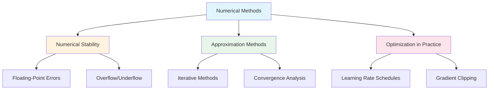
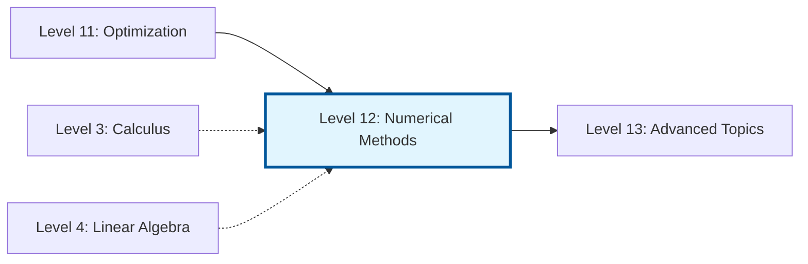

# Level 12: Numerical Methods - Engineering Reality

## Overview

Welcome to Level 12, where we bridge the gap between mathematical theory and computational practice. In the real world of machine learning, we don't have infinite precision or unlimited computational resources. This level teaches you how to work within these constraints while maintaining accuracy and stability.

## Why Numerical Methods Matter for ML

Machine learning algorithms live and die by their numerical implementations. A mathematically correct algorithm can produce garbage results if implemented without consideration for numerical stability. Consider these real-world scenarios:

- **Deep neural networks** with hundreds of layers can see gradients explode to infinity or vanish to zero
- **Softmax functions** can overflow when dealing with large logits
- **Matrix inversions** can become unstable with ill-conditioned matrices
- **Optimization algorithms** can diverge or oscillate without proper tuning

Understanding numerical methods transforms you from someone who uses ML libraries to someone who understands why they work and how to fix them when they don't.

## Chapter Overview



### Chapter 1: Numerical Stability
Learn why `0.1 + 0.2 != 0.3` in floating-point arithmetic and how this affects every ML computation you make. We cover:
- IEEE 754 floating-point representation
- Sources of numerical error
- Overflow and underflow conditions
- Stable implementations of common operations (softmax, log-sum-exp)

### Chapter 2: Approximation Methods
Understand how iterative algorithms converge to solutions and when they might fail. Topics include:
- Fixed-point iteration
- Newton's method and its variants
- Convergence rates and conditions
- Practical stopping criteria

### Chapter 3: Optimization in Practice
Master the practical tools that make gradient-based optimization work in production. Learn about:
- Learning rate schedules (step decay, exponential, cosine annealing, warmup)
- Gradient clipping strategies
- Adaptive learning rate methods
- Handling pathological optimization landscapes

## Prerequisites

Before diving into this level, ensure you're comfortable with:
- **Calculus**: Derivatives, gradients, Taylor series (Level 3)
- **Linear Algebra**: Matrix operations, eigenvalues (Level 4-6)
- **Optimization Theory**: Gradient descent basics (Level 11)
- **Python**: NumPy operations, basic ML frameworks

## Learning Objectives

By the end of this level, you will be able to:

1. **Identify** numerical stability issues in ML code before they cause problems
2. **Implement** numerically stable versions of common operations
3. **Analyze** convergence behavior of iterative algorithms
4. **Design** appropriate learning rate schedules for different training scenarios
5. **Debug** optimization failures caused by numerical issues

## Key Formulas Preview

### Machine Epsilon
$$\epsilon_{\text{machine}} \approx 2.22 \times 10^{-16} \text{ (float64)}$$

### Log-Sum-Exp Trick
$$\log\sum_i e^{x_i} = x_{\max} + \log\sum_i e^{x_i - x_{\max}}$$

### Convergence Rate
$$\|x_{k+1} - x^*\| \leq C \|x_k - x^*\|^p$$

Where $p=1$ is linear, $p=2$ is quadratic convergence.

### Gradient Clipping
$$g_{\text{clipped}} = g \cdot \min\left(1, \frac{\theta}{\|g\|}\right)$$

## Practical Toolkit

Throughout this level, you'll build a toolkit of numerically stable implementations:

```python
# Preview of techniques you'll master
import numpy as np

# Stable softmax
def stable_softmax(x):
    x_max = np.max(x, axis=-1, keepdims=True)
    exp_x = np.exp(x - x_max)
    return exp_x / np.sum(exp_x, axis=-1, keepdims=True)

# Gradient clipping
def clip_gradient(grad, max_norm):
    norm = np.linalg.norm(grad)
    if norm > max_norm:
        return grad * max_norm / norm
    return grad

# Stable log computation
def safe_log(x, eps=1e-10):
    return np.log(np.maximum(x, eps))
```

## Connection to Other Levels



## How to Use This Level

1. **Read the theory** to understand why numerical issues arise
2. **Run the code examples** to see problems in action
3. **Complete the exercises** to build intuition
4. **Apply to your projects** to solidify understanding

Each chapter includes working Python code that demonstrates both the problems and solutions. We encourage you to modify and experiment with these examples.

## Real-World Impact

Companies like Google, Meta, and OpenAI invest heavily in numerical stability:

- **Mixed-precision training** uses different floating-point formats strategically
- **Gradient checkpointing** trades computation for numerical stability
- **Loss scaling** prevents underflow in low-precision training
- **Careful initialization** prevents exploding/vanishing gradients from the start

Understanding these techniques separates production-ready ML engineers from those who can only use high-level APIs.

---

Let's begin our journey into the engineering reality of numerical computation. Start with Chapter 1 to understand the fundamental limitations of floating-point arithmetic.
