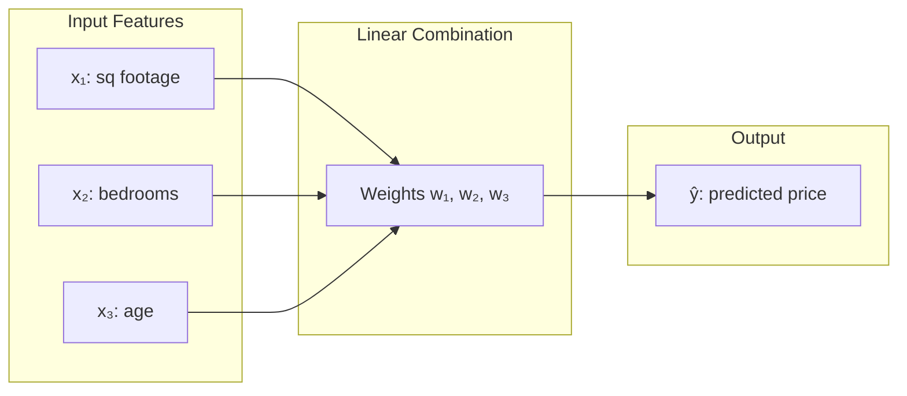
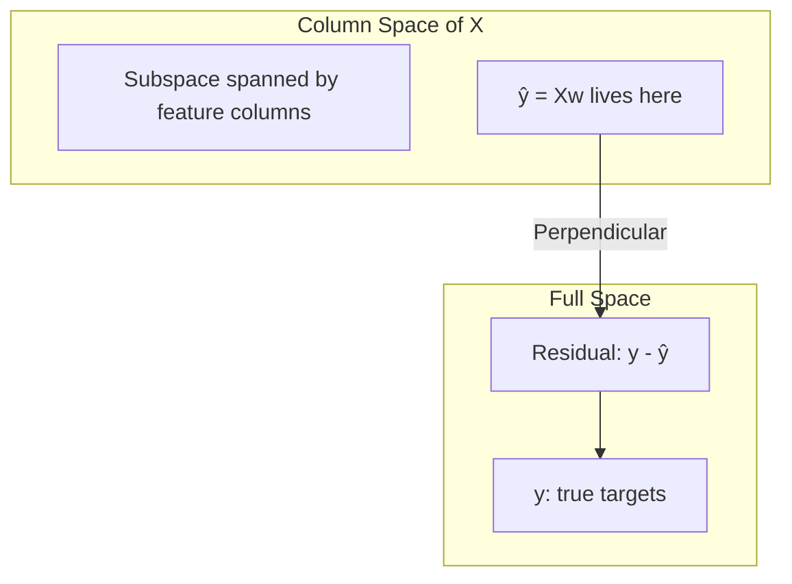

# Chapter 1: Linear Regression

## Intuition

Linear regression is the "Hello World" of machine learning, yet its mathematical foundation reveals deep connections to statistics, linear algebra, and optimization. At its core, linear regression answers a simple question: **given data points, what's the best straight line (or hyperplane) that fits them?**

### Plain English Explanation

Imagine you're a real estate agent trying to predict house prices. You notice that price seems to depend on square footage. You could draw a line through your data points and use that line to predict prices for new houses. Linear regression finds the "best" line - the one that makes the smallest prediction errors overall.

### Real-World Analogy

Think of linear regression like finding the best-fit ruler through a cloud of points. You can rotate and shift the ruler, and for each position, you measure how far off each point is from the ruler. Linear regression mathematically finds the ruler position that minimizes these distances (specifically, the squared distances).

### Why This Matters for ML

Linear regression is:
- The foundation for understanding more complex models
- Still widely used in production systems
- The starting point for regularization techniques (Ridge, Lasso)
- A building block inside neural networks (each neuron performs linear regression followed by nonlinearity)

## Visual Explanation

### The Setup



### The Model

The linear regression model predicts:

$$\hat{y} = w_0 + w_1 x_1 + w_2 x_2 + \cdots + w_d x_d = \mathbf{w}^T \mathbf{x}$$

Or in matrix form for all $n$ samples:

$$\hat{\mathbf{y}} = \mathbf{X}\mathbf{w}$$

Where:
- $\mathbf{X}$ is the $(n \times d)$ design matrix (with a column of 1s for the intercept)
- $\mathbf{w}$ is the $(d \times 1)$ weight vector
- $\hat{\mathbf{y}}$ is the $(n \times 1)$ prediction vector

### Geometric View



The key insight: $\hat{\mathbf{y}}$ is the **projection** of $\mathbf{y}$ onto the column space of $\mathbf{X}$. The residual $\mathbf{y} - \hat{\mathbf{y}}$ is perpendicular to this space.

## Mathematical Foundation

### The Least Squares Objective

We want to find weights $\mathbf{w}$ that minimize the **Mean Squared Error (MSE)**:

$$L(\mathbf{w}) = \frac{1}{n} \sum_{i=1}^{n} (y_i - \hat{y}_i)^2 = \frac{1}{n} \|\mathbf{y} - \mathbf{X}\mathbf{w}\|^2$$

In matrix notation:

$$L(\mathbf{w}) = \frac{1}{n} (\mathbf{y} - \mathbf{X}\mathbf{w})^T (\mathbf{y} - \mathbf{X}\mathbf{w})$$

### Deriving the Normal Equation

To find the minimum, we set the gradient to zero. Let's expand the loss:

$$L(\mathbf{w}) = \frac{1}{n} \left( \mathbf{y}^T\mathbf{y} - 2\mathbf{y}^T\mathbf{X}\mathbf{w} + \mathbf{w}^T\mathbf{X}^T\mathbf{X}\mathbf{w} \right)$$

Taking the gradient with respect to $\mathbf{w}$:

$$\nabla_\mathbf{w} L = \frac{1}{n} \left( -2\mathbf{X}^T\mathbf{y} + 2\mathbf{X}^T\mathbf{X}\mathbf{w} \right)$$

Setting the gradient to zero:

$$\mathbf{X}^T\mathbf{X}\mathbf{w} = \mathbf{X}^T\mathbf{y}$$

This is the **Normal Equation**. Solving for $\mathbf{w}$:

$$\boxed{\mathbf{w}^* = (\mathbf{X}^T\mathbf{X})^{-1}\mathbf{X}^T\mathbf{y}}$$

### Why "Normal"?

The equation is called "normal" because it enforces that the residual vector $(\mathbf{y} - \mathbf{X}\mathbf{w})$ is **normal** (perpendicular) to the column space of $\mathbf{X}$:

$$\mathbf{X}^T(\mathbf{y} - \mathbf{X}\mathbf{w}^*) = \mathbf{0}$$

### Matrix Calculus Refresher

For the derivation above, we used these matrix calculus identities:

| Expression | Gradient w.r.t. $\mathbf{w}$ |
|------------|------------------------------|
| $\mathbf{a}^T\mathbf{w}$ | $\mathbf{a}$ |
| $\mathbf{w}^T\mathbf{A}\mathbf{w}$ | $2\mathbf{A}\mathbf{w}$ (if $\mathbf{A}$ symmetric) |

### Probabilistic Interpretation

Under the assumption that targets follow:

$$y_i = \mathbf{w}^T\mathbf{x}_i + \epsilon_i, \quad \epsilon_i \sim \mathcal{N}(0, \sigma^2)$$

The likelihood of the data is:

$$p(\mathbf{y}|\mathbf{X}, \mathbf{w}) = \prod_{i=1}^{n} \frac{1}{\sqrt{2\pi\sigma^2}} \exp\left(-\frac{(y_i - \mathbf{w}^T\mathbf{x}_i)^2}{2\sigma^2}\right)$$

Taking the negative log-likelihood:

$$-\log p(\mathbf{y}|\mathbf{X}, \mathbf{w}) = \frac{n}{2}\log(2\pi\sigma^2) + \frac{1}{2\sigma^2}\sum_{i=1}^{n}(y_i - \mathbf{w}^T\mathbf{x}_i)^2$$

Minimizing this is equivalent to minimizing the sum of squared errors! **Maximum likelihood estimation under Gaussian noise gives us least squares.**

## Code Example

```python
import numpy as np
import matplotlib.pyplot as plt

class LinearRegressionFromScratch:
    """
    Linear Regression implemented from scratch using the Normal Equation.
    """

    def __init__(self, fit_intercept=True):
        self.fit_intercept = fit_intercept
        self.weights = None

    def fit(self, X, y):
        """
        Fit the model using the Normal Equation: w = (X^T X)^(-1) X^T y

        Parameters:
        -----------
        X : numpy array of shape (n_samples, n_features)
        y : numpy array of shape (n_samples,)
        """
        X = np.array(X)
        y = np.array(y).reshape(-1, 1)

        # Add bias column if fitting intercept
        if self.fit_intercept:
            X = np.column_stack([np.ones(X.shape[0]), X])

        # Normal Equation: w = (X^T X)^(-1) X^T y
        XtX = X.T @ X
        Xty = X.T @ y

        # Solve the system (more numerically stable than direct inverse)
        self.weights = np.linalg.solve(XtX, Xty)

        return self

    def predict(self, X):
        """Make predictions."""
        X = np.array(X)
        if self.fit_intercept:
            X = np.column_stack([np.ones(X.shape[0]), X])
        return (X @ self.weights).flatten()

    def score(self, X, y):
        """Calculate R-squared score."""
        y_pred = self.predict(X)
        ss_res = np.sum((y - y_pred) ** 2)
        ss_tot = np.sum((y - np.mean(y)) ** 2)
        return 1 - (ss_res / ss_tot)


class LinearRegressionGD:
    """
    Linear Regression using Gradient Descent (for comparison).
    """

    def __init__(self, learning_rate=0.01, n_iterations=1000, fit_intercept=True):
        self.lr = learning_rate
        self.n_iterations = n_iterations
        self.fit_intercept = fit_intercept
        self.weights = None
        self.loss_history = []

    def fit(self, X, y):
        """Fit using gradient descent."""
        X = np.array(X)
        y = np.array(y).reshape(-1, 1)
        n_samples = X.shape[0]

        if self.fit_intercept:
            X = np.column_stack([np.ones(n_samples), X])

        n_features = X.shape[1]

        # Initialize weights randomly
        self.weights = np.random.randn(n_features, 1) * 0.01

        # Gradient descent
        for _ in range(self.n_iterations):
            # Predictions
            y_pred = X @ self.weights

            # Compute loss
            loss = np.mean((y - y_pred) ** 2)
            self.loss_history.append(loss)

            # Compute gradient: d(MSE)/dw = -2/n * X^T(y - y_pred)
            gradient = -2/n_samples * X.T @ (y - y_pred)

            # Update weights
            self.weights -= self.lr * gradient

        return self

    def predict(self, X):
        """Make predictions."""
        X = np.array(X)
        if self.fit_intercept:
            X = np.column_stack([np.ones(X.shape[0]), X])
        return (X @ self.weights).flatten()


# Demonstration
if __name__ == "__main__":
    # Generate synthetic data
    np.random.seed(42)
    n_samples = 100
    X = 2 * np.random.rand(n_samples, 1)
    y = 4 + 3 * X.flatten() + np.random.randn(n_samples) * 0.5  # y = 4 + 3x + noise

    # Fit using Normal Equation
    model_ne = LinearRegressionFromScratch()
    model_ne.fit(X, y)
    print("Normal Equation Solution:")
    print(f"  Intercept: {model_ne.weights[0, 0]:.4f} (true: 4)")
    print(f"  Slope: {model_ne.weights[1, 0]:.4f} (true: 3)")
    print(f"  R-squared: {model_ne.score(X, y):.4f}")

    # Fit using Gradient Descent
    model_gd = LinearRegressionGD(learning_rate=0.1, n_iterations=1000)
    model_gd.fit(X, y)
    print("\nGradient Descent Solution:")
    print(f"  Intercept: {model_gd.weights[0, 0]:.4f}")
    print(f"  Slope: {model_gd.weights[1, 0]:.4f}")

    # Visualization
    fig, axes = plt.subplots(1, 2, figsize=(12, 4))

    # Plot 1: Data and fitted line
    axes[0].scatter(X, y, alpha=0.6, label='Data')
    X_line = np.linspace(0, 2, 100).reshape(-1, 1)
    axes[0].plot(X_line, model_ne.predict(X_line), 'r-', linewidth=2, label='Fitted line')
    axes[0].set_xlabel('X')
    axes[0].set_ylabel('y')
    axes[0].set_title('Linear Regression Fit')
    axes[0].legend()

    # Plot 2: Loss curve for gradient descent
    axes[1].plot(model_gd.loss_history)
    axes[1].set_xlabel('Iteration')
    axes[1].set_ylabel('MSE Loss')
    axes[1].set_title('Gradient Descent Convergence')

    plt.tight_layout()
    plt.savefig('linear_regression_demo.png', dpi=100)
    plt.show()
```

### Output
```
Normal Equation Solution:
  Intercept: 4.0245 (true: 4)
  Slope: 2.9690 (true: 3)
  R-squared: 0.9477

Gradient Descent Solution:
  Intercept: 4.0245
  Slope: 2.9690
```

## ML Relevance

### Where Linear Regression Appears

1. **Standalone Prediction**: Predicting continuous values (prices, temperatures, stock returns)
2. **Feature Importance**: The weights indicate feature importance
3. **Baseline Model**: Often the first model to try - if it works well, you might not need complexity
4. **Inside Neural Networks**: Each neuron computes $\mathbf{w}^T\mathbf{x} + b$ before applying activation

### Extensions

| Extension | Modification |
|-----------|--------------|
| **Ridge Regression** | Add $\lambda\|\mathbf{w}\|_2^2$ to loss (L2 regularization) |
| **Lasso Regression** | Add $\lambda\|\mathbf{w}\|_1$ to loss (L1 regularization) |
| **Polynomial Regression** | Transform features: $[x, x^2, x^3, ...]$ |
| **Bayesian Linear Regression** | Place priors on weights |

### Ridge Regression Solution

With L2 regularization, the loss becomes:

$$L(\mathbf{w}) = \|\mathbf{y} - \mathbf{X}\mathbf{w}\|^2 + \lambda\|\mathbf{w}\|^2$$

The closed-form solution becomes:

$$\mathbf{w}^* = (\mathbf{X}^T\mathbf{X} + \lambda\mathbf{I})^{-1}\mathbf{X}^T\mathbf{y}$$

The addition of $\lambda\mathbf{I}$ ensures the matrix is always invertible!

## When to Use / Ignore

### Use Linear Regression When:
- You have a linear relationship between features and target
- Interpretability is important (weights have clear meaning)
- You need a fast, simple baseline
- Features are independent (low multicollinearity)

### Avoid When:
- Relationship is clearly nonlinear
- Features are highly correlated (use Ridge/Lasso instead)
- Target is categorical (use logistic regression or classification models)
- You have outliers (consider robust regression)

### Common Pitfalls

1. **Multicollinearity**: When features are correlated, $\mathbf{X}^T\mathbf{X}$ becomes nearly singular
   - *Solution*: Use Ridge regression or drop correlated features

2. **Forgetting to Scale**: Features on different scales can cause numerical issues
   - *Solution*: Standardize features (zero mean, unit variance)

3. **Overfitting**: Too many features relative to samples
   - *Solution*: Regularization (Ridge, Lasso)

4. **Ignoring Residuals**: Always check if residuals are random
   - *Solution*: Plot residuals; patterns indicate model misspecification

## Exercises

### Exercise 1: Derive the Gradient
**Problem**: Starting from the MSE loss $L(\mathbf{w}) = \frac{1}{n}\|\mathbf{y} - \mathbf{X}\mathbf{w}\|^2$, derive the gradient $\nabla_\mathbf{w} L$ step by step.

**Solution**:
$$L(\mathbf{w}) = \frac{1}{n}(\mathbf{y} - \mathbf{X}\mathbf{w})^T(\mathbf{y} - \mathbf{X}\mathbf{w})$$

Let $\mathbf{r} = \mathbf{y} - \mathbf{X}\mathbf{w}$. Then $L = \frac{1}{n}\mathbf{r}^T\mathbf{r}$.

Expanding:
$$L = \frac{1}{n}(\mathbf{y}^T\mathbf{y} - 2\mathbf{y}^T\mathbf{X}\mathbf{w} + \mathbf{w}^T\mathbf{X}^T\mathbf{X}\mathbf{w})$$

Taking derivatives:
- $\frac{\partial}{\partial \mathbf{w}}(\mathbf{y}^T\mathbf{y}) = \mathbf{0}$
- $\frac{\partial}{\partial \mathbf{w}}(\mathbf{y}^T\mathbf{X}\mathbf{w}) = \mathbf{X}^T\mathbf{y}$
- $\frac{\partial}{\partial \mathbf{w}}(\mathbf{w}^T\mathbf{X}^T\mathbf{X}\mathbf{w}) = 2\mathbf{X}^T\mathbf{X}\mathbf{w}$

Therefore:
$$\nabla_\mathbf{w} L = \frac{1}{n}(-2\mathbf{X}^T\mathbf{y} + 2\mathbf{X}^T\mathbf{X}\mathbf{w}) = \frac{2}{n}\mathbf{X}^T(\mathbf{X}\mathbf{w} - \mathbf{y})$$

### Exercise 2: Ridge Regression
**Problem**: Modify the `LinearRegressionFromScratch` class to implement Ridge Regression with regularization parameter $\lambda$.

**Solution**:
```python
def fit_ridge(self, X, y, lambda_reg):
    X = np.array(X)
    y = np.array(y).reshape(-1, 1)

    if self.fit_intercept:
        X = np.column_stack([np.ones(X.shape[0]), X])

    n_features = X.shape[1]

    # Ridge: w = (X^T X + lambda * I)^(-1) X^T y
    XtX = X.T @ X
    regularizer = lambda_reg * np.eye(n_features)
    if self.fit_intercept:
        regularizer[0, 0] = 0  # Don't regularize intercept

    self.weights = np.linalg.solve(XtX + regularizer, X.T @ y)
    return self
```

### Exercise 3: Computational Complexity
**Problem**: What is the computational complexity of solving the normal equation? When might gradient descent be preferred?

**Solution**:
- Computing $\mathbf{X}^T\mathbf{X}$: $O(nd^2)$
- Solving the $d \times d$ system: $O(d^3)$
- Total: $O(nd^2 + d^3)$

Gradient descent is preferred when:
- $d$ is very large (solving $d \times d$ system is expensive)
- Data arrives in streams (online learning)
- Approximate solution is acceptable
- Memory is limited (normal equation requires storing $\mathbf{X}^T\mathbf{X}$)

## Summary

- **Linear regression** finds the best linear mapping from features to targets by minimizing squared error

- The **Normal Equation** provides a closed-form solution:
  $$\mathbf{w}^* = (\mathbf{X}^T\mathbf{X})^{-1}\mathbf{X}^T\mathbf{y}$$

- **Geometrically**, linear regression projects targets onto the column space of features

- **Probabilistically**, least squares equals maximum likelihood estimation under Gaussian noise

- **Ridge regression** adds $\lambda\mathbf{I}$ to handle multicollinearity and prevent overfitting

- Always check **residuals** for patterns indicating model misspecification

---

**Next Chapter**: [Logistic Regression](./02-logistic-regression.md)
