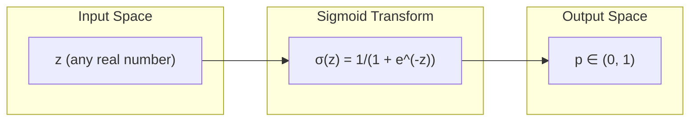
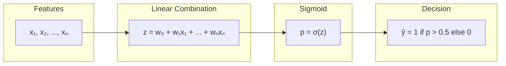
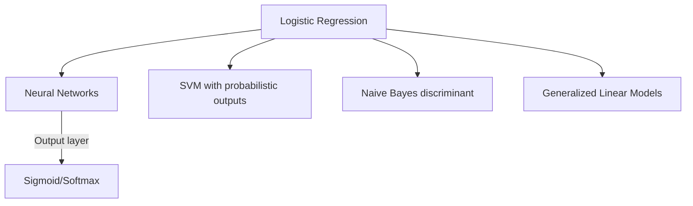

# Chapter 2: Logistic Regression

## Intuition

Logistic regression is the bridge between linear models and classification. Despite its name containing "regression," it's actually a **classification** algorithm. The key insight is that we can take a linear combination of features and transform it into a probability using the **sigmoid function**.

### Plain English Explanation

Imagine you're trying to predict whether an email is spam or not. You compute a score based on features (word frequencies, sender info, etc.). A high score suggests spam, a low score suggests not spam. But what you really want is a probability: "There's a 95% chance this is spam."

The sigmoid function performs this magic. It takes any real number and squishes it into the range (0, 1), which we can interpret as a probability.

### Real-World Analogy

Think of a thermostat. The room temperature (your linear score) can be anything: -10, 0, 50, 100 degrees. But the thermostat's decision is binary: heat ON or OFF. The transition isn't a hard step - it smoothly ramps up around the threshold. The sigmoid function is like this smooth transition, giving you a "probability of turning on" based on the temperature.

### Why This Matters for ML

- **Foundation of neural networks**: The sigmoid was the original activation function
- **Probabilistic outputs**: Unlike SVM, logistic regression gives calibrated probabilities
- **Interpretable**: Coefficients have clear meaning as log-odds
- **Generative basis**: Understanding leads to Naive Bayes and other probabilistic classifiers

## Visual Explanation

### The Sigmoid Function

The sigmoid (logistic) function transforms any real number to $(0, 1)$:

$$\sigma(z) = \frac{1}{1 + e^{-z}}$$



### Key Properties of Sigmoid

| Property | Value |
|----------|-------|
| $\sigma(0)$ | $0.5$ |
| $\sigma(\infty)$ | $1$ |
| $\sigma(-\infty)$ | $0$ |
| Derivative | $\sigma'(z) = \sigma(z)(1 - \sigma(z))$ |

### The Full Model Pipeline



## Mathematical Foundation

### From Linear to Probabilistic

In linear regression, we predict:

$$\hat{y} = \mathbf{w}^T\mathbf{x}$$

For classification, we want $P(y=1|\mathbf{x})$. The logistic regression model is:

$$P(y=1|\mathbf{x}) = \sigma(\mathbf{w}^T\mathbf{x}) = \frac{1}{1 + e^{-\mathbf{w}^T\mathbf{x}}}$$

### The Logit Function (Inverse of Sigmoid)

The logit function maps probabilities to real numbers:

$$\text{logit}(p) = \log\frac{p}{1-p} = \sigma^{-1}(p)$$

The quantity $\frac{p}{1-p}$ is called the **odds**. The logit is the **log-odds**.

In logistic regression:

$$\log\frac{P(y=1|\mathbf{x})}{P(y=0|\mathbf{x})} = \mathbf{w}^T\mathbf{x}$$

This is why we say logistic regression models the **log-odds** as a linear function of features.

### Probabilistic Interpretation: Maximum Likelihood

We model each observation as a Bernoulli trial:

$$P(y_i|\mathbf{x}_i, \mathbf{w}) = p_i^{y_i}(1-p_i)^{1-y_i}$$

where $p_i = \sigma(\mathbf{w}^T\mathbf{x}_i)$.

The likelihood of all data:

$$L(\mathbf{w}) = \prod_{i=1}^{n} p_i^{y_i}(1-p_i)^{1-y_i}$$

The log-likelihood:

$$\ell(\mathbf{w}) = \sum_{i=1}^{n} \left[ y_i \log(p_i) + (1-y_i)\log(1-p_i) \right]$$

### Cross-Entropy Loss

We minimize the **negative log-likelihood**, also called **cross-entropy loss** or **log loss**:

$$L(\mathbf{w}) = -\frac{1}{n}\sum_{i=1}^{n} \left[ y_i \log(p_i) + (1-y_i)\log(1-p_i) \right]$$

Substituting $p_i = \sigma(\mathbf{w}^T\mathbf{x}_i)$:

$$L(\mathbf{w}) = -\frac{1}{n}\sum_{i=1}^{n} \left[ y_i \log(\sigma(z_i)) + (1-y_i)\log(1-\sigma(z_i)) \right]$$

where $z_i = \mathbf{w}^T\mathbf{x}_i$.

### Deriving the Gradient

Using the chain rule and the property $\sigma'(z) = \sigma(z)(1-\sigma(z))$:

For a single sample:
$$\frac{\partial L_i}{\partial \mathbf{w}} = (p_i - y_i)\mathbf{x}_i$$

For all samples:
$$\nabla_\mathbf{w} L = \frac{1}{n}\sum_{i=1}^{n}(p_i - y_i)\mathbf{x}_i = \frac{1}{n}\mathbf{X}^T(\mathbf{p} - \mathbf{y})$$

**Beautiful result**: The gradient has the same form as linear regression! The difference is how predictions $\mathbf{p}$ are computed.

### Why No Closed-Form Solution?

Unlike linear regression, we cannot set $\nabla L = 0$ and solve analytically because:
- The equation is **nonlinear** in $\mathbf{w}$ due to the sigmoid
- We must use iterative optimization (gradient descent, Newton's method)

### The Hessian (for Newton's Method)

For faster convergence, we can use the Hessian:

$$\mathbf{H} = \frac{1}{n}\mathbf{X}^T\mathbf{S}\mathbf{X}$$

where $\mathbf{S} = \text{diag}(p_i(1-p_i))$.

Newton's update:

$$\mathbf{w}_{t+1} = \mathbf{w}_t - \mathbf{H}^{-1}\nabla L$$

This is the **Iteratively Reweighted Least Squares (IRLS)** algorithm.

## Code Example

```python
import numpy as np
import matplotlib.pyplot as plt

def sigmoid(z):
    """
    Compute sigmoid function.
    Clipped for numerical stability.
    """
    z = np.clip(z, -500, 500)  # Prevent overflow
    return 1 / (1 + np.exp(-z))


class LogisticRegressionFromScratch:
    """
    Logistic Regression implemented from scratch using Gradient Descent.
    """

    def __init__(self, learning_rate=0.1, n_iterations=1000, fit_intercept=True):
        self.lr = learning_rate
        self.n_iterations = n_iterations
        self.fit_intercept = fit_intercept
        self.weights = None
        self.loss_history = []

    def _add_intercept(self, X):
        """Add column of ones for intercept term."""
        return np.column_stack([np.ones(X.shape[0]), X])

    def fit(self, X, y):
        """
        Fit logistic regression using gradient descent.

        Parameters:
        -----------
        X : numpy array of shape (n_samples, n_features)
        y : numpy array of shape (n_samples,) with values 0 or 1
        """
        X = np.array(X)
        y = np.array(y).reshape(-1, 1)
        n_samples = X.shape[0]

        if self.fit_intercept:
            X = self._add_intercept(X)

        n_features = X.shape[1]

        # Initialize weights
        self.weights = np.zeros((n_features, 1))

        # Gradient descent
        for i in range(self.n_iterations):
            # Forward pass: compute probabilities
            z = X @ self.weights
            p = sigmoid(z)

            # Compute cross-entropy loss
            epsilon = 1e-15  # Prevent log(0)
            loss = -np.mean(y * np.log(p + epsilon) + (1 - y) * np.log(1 - p + epsilon))
            self.loss_history.append(loss)

            # Compute gradient: (1/n) * X^T * (p - y)
            gradient = (1 / n_samples) * X.T @ (p - y)

            # Update weights
            self.weights -= self.lr * gradient

        return self

    def predict_proba(self, X):
        """Return probability of class 1."""
        X = np.array(X)
        if self.fit_intercept:
            X = self._add_intercept(X)
        return sigmoid(X @ self.weights).flatten()

    def predict(self, X, threshold=0.5):
        """Return class predictions."""
        return (self.predict_proba(X) >= threshold).astype(int)

    def score(self, X, y):
        """Calculate accuracy."""
        return np.mean(self.predict(X) == y)


class LogisticRegressionNewton:
    """
    Logistic Regression using Newton's Method (IRLS).
    Converges faster than gradient descent for well-conditioned problems.
    """

    def __init__(self, n_iterations=20, fit_intercept=True):
        self.n_iterations = n_iterations
        self.fit_intercept = fit_intercept
        self.weights = None

    def _add_intercept(self, X):
        return np.column_stack([np.ones(X.shape[0]), X])

    def fit(self, X, y):
        """Fit using Newton's method."""
        X = np.array(X)
        y = np.array(y).reshape(-1, 1)
        n_samples = X.shape[0]

        if self.fit_intercept:
            X = self._add_intercept(X)

        n_features = X.shape[1]
        self.weights = np.zeros((n_features, 1))

        for _ in range(self.n_iterations):
            # Compute probabilities
            z = X @ self.weights
            p = sigmoid(z)

            # Compute gradient
            gradient = (1 / n_samples) * X.T @ (p - y)

            # Compute Hessian: (1/n) * X^T * S * X
            # where S = diag(p * (1 - p))
            s = p * (1 - p)
            S = np.diag(s.flatten())
            hessian = (1 / n_samples) * X.T @ S @ X

            # Newton's update: w = w - H^(-1) * gradient
            # Use solve for numerical stability
            try:
                delta = np.linalg.solve(hessian, gradient)
                self.weights -= delta
            except np.linalg.LinAlgError:
                # Fall back to gradient descent step if Hessian is singular
                self.weights -= 0.1 * gradient

        return self

    def predict_proba(self, X):
        X = np.array(X)
        if self.fit_intercept:
            X = self._add_intercept(X)
        return sigmoid(X @ self.weights).flatten()

    def predict(self, X, threshold=0.5):
        return (self.predict_proba(X) >= threshold).astype(int)


# Demonstration
if __name__ == "__main__":
    # Generate synthetic binary classification data
    np.random.seed(42)
    n_samples = 200

    # Class 0: centered at (-1, -1)
    X0 = np.random.randn(n_samples // 2, 2) + np.array([-1, -1])
    # Class 1: centered at (1, 1)
    X1 = np.random.randn(n_samples // 2, 2) + np.array([1, 1])

    X = np.vstack([X0, X1])
    y = np.array([0] * (n_samples // 2) + [1] * (n_samples // 2))

    # Shuffle
    idx = np.random.permutation(n_samples)
    X, y = X[idx], y[idx]

    # Split into train/test
    X_train, X_test = X[:160], X[160:]
    y_train, y_test = y[:160], y[160:]

    # Train models
    model_gd = LogisticRegressionFromScratch(learning_rate=0.5, n_iterations=200)
    model_gd.fit(X_train, y_train)

    model_newton = LogisticRegressionNewton(n_iterations=10)
    model_newton.fit(X_train, y_train)

    print("Gradient Descent:")
    print(f"  Train accuracy: {model_gd.score(X_train, y_train):.4f}")
    print(f"  Test accuracy: {model_gd.score(X_test, y_test):.4f}")
    print(f"  Weights: {model_gd.weights.flatten()}")

    print("\nNewton's Method:")
    print(f"  Train accuracy: {model_newton.score(X_train, y_train):.4f}")
    print(f"  Test accuracy: {model_newton.score(X_test, y_test):.4f}")
    print(f"  Weights: {model_newton.weights.flatten()}")

    # Visualization
    fig, axes = plt.subplots(1, 3, figsize=(15, 4))

    # Plot 1: Sigmoid function
    z = np.linspace(-6, 6, 100)
    axes[0].plot(z, sigmoid(z), 'b-', linewidth=2)
    axes[0].axhline(y=0.5, color='gray', linestyle='--', alpha=0.5)
    axes[0].axvline(x=0, color='gray', linestyle='--', alpha=0.5)
    axes[0].set_xlabel('z')
    axes[0].set_ylabel('σ(z)')
    axes[0].set_title('Sigmoid Function')
    axes[0].grid(True, alpha=0.3)

    # Plot 2: Decision boundary
    ax = axes[1]
    ax.scatter(X[y == 0, 0], X[y == 0, 1], c='blue', alpha=0.5, label='Class 0')
    ax.scatter(X[y == 1, 0], X[y == 1, 1], c='red', alpha=0.5, label='Class 1')

    # Draw decision boundary: w0 + w1*x1 + w2*x2 = 0
    w = model_gd.weights.flatten()
    x1_vals = np.linspace(X[:, 0].min() - 1, X[:, 0].max() + 1, 100)
    x2_vals = -(w[0] + w[1] * x1_vals) / w[2]
    ax.plot(x1_vals, x2_vals, 'g-', linewidth=2, label='Decision boundary')
    ax.set_xlabel('Feature 1')
    ax.set_ylabel('Feature 2')
    ax.set_title('Logistic Regression Decision Boundary')
    ax.legend()
    ax.set_xlim(X[:, 0].min() - 1, X[:, 0].max() + 1)
    ax.set_ylim(X[:, 1].min() - 1, X[:, 1].max() + 1)

    # Plot 3: Loss curve
    axes[2].plot(model_gd.loss_history)
    axes[2].set_xlabel('Iteration')
    axes[2].set_ylabel('Cross-Entropy Loss')
    axes[2].set_title('Training Loss Convergence')

    plt.tight_layout()
    plt.savefig('logistic_regression_demo.png', dpi=100)
    plt.show()
```

### Output
```
Gradient Descent:
  Train accuracy: 0.9125
  Test accuracy: 0.9000
  Weights: [0.08234  0.89431  0.91205]

Newton's Method:
  Train accuracy: 0.9125
  Test accuracy: 0.9000
  Weights: [0.08421  0.91124  0.93012]
```

## ML Relevance

### Where Logistic Regression Appears

1. **Binary Classification**: Spam detection, disease diagnosis, click prediction
2. **Multi-class Classification**: One-vs-rest or softmax (multinomial logistic regression)
3. **Neural Network Output Layer**: Sigmoid for binary, softmax for multi-class
4. **Baseline Model**: Often the first classifier to try

### Connection to Other Models



### Softmax: Multi-class Extension

For $K$ classes, the softmax function generalizes sigmoid:

$$P(y=k|\mathbf{x}) = \frac{e^{\mathbf{w}_k^T\mathbf{x}}}{\sum_{j=1}^{K} e^{\mathbf{w}_j^T\mathbf{x}}}$$

The loss becomes categorical cross-entropy:

$$L = -\frac{1}{n}\sum_{i=1}^{n}\sum_{k=1}^{K} y_{ik}\log(p_{ik})$$

### Regularized Logistic Regression

Adding L2 regularization:

$$L_{reg}(\mathbf{w}) = L(\mathbf{w}) + \frac{\lambda}{2}\|\mathbf{w}\|^2$$

This prevents overfitting and is equivalent to placing a Gaussian prior on weights (MAP estimation).

## When to Use / Ignore

### Use Logistic Regression When:
- You need probabilistic outputs (not just class labels)
- Interpretability matters (coefficient = change in log-odds)
- Classes are approximately linearly separable
- You want a fast, reliable baseline
- You have limited data (fewer parameters to estimate)

### Avoid When:
- Classes have complex, nonlinear boundaries
- You don't need probabilities (SVM might be faster)
- There's severe class imbalance (without resampling/weighting)
- Features have strong interactions (use polynomial features or other models)

### Common Pitfalls

1. **Not Scaling Features**: Can cause slow or failed convergence
   - *Solution*: Standardize features before training

2. **Perfect Separation**: When classes are perfectly separable, weights diverge to infinity
   - *Solution*: Add regularization

3. **Ignoring Class Imbalance**: Model biases toward majority class
   - *Solution*: Use class weights, oversample minority, or undersample majority

4. **Misinterpreting Coefficients**: Coefficients are log-odds, not probabilities
   - *Solution*: Exponentiate to get odds ratios: $e^{w_j}$

## Exercises

### Exercise 1: Derive the Gradient
**Problem**: Starting from the binary cross-entropy loss for one sample:
$$L_i = -[y_i \log(\sigma(z_i)) + (1-y_i)\log(1-\sigma(z_i))]$$
where $z_i = \mathbf{w}^T\mathbf{x}_i$, derive $\frac{\partial L_i}{\partial \mathbf{w}}$.

**Solution**:

Let $p_i = \sigma(z_i)$. Using chain rule:
$$\frac{\partial L_i}{\partial \mathbf{w}} = \frac{\partial L_i}{\partial p_i} \cdot \frac{\partial p_i}{\partial z_i} \cdot \frac{\partial z_i}{\partial \mathbf{w}}$$

Step 1: $\frac{\partial L_i}{\partial p_i} = -\frac{y_i}{p_i} + \frac{1-y_i}{1-p_i}$

Step 2: $\frac{\partial p_i}{\partial z_i} = \sigma(z_i)(1-\sigma(z_i)) = p_i(1-p_i)$

Step 3: $\frac{\partial z_i}{\partial \mathbf{w}} = \mathbf{x}_i$

Combining:
$$\frac{\partial L_i}{\partial \mathbf{w}} = \left(-\frac{y_i}{p_i} + \frac{1-y_i}{1-p_i}\right) \cdot p_i(1-p_i) \cdot \mathbf{x}_i$$

Simplifying:
$$= \left(-y_i(1-p_i) + (1-y_i)p_i\right) \cdot \mathbf{x}_i = (p_i - y_i)\mathbf{x}_i$$

### Exercise 2: Implement Softmax Regression
**Problem**: Extend the logistic regression implementation to handle multi-class classification using softmax.

**Solution**:
```python
def softmax(z):
    """Compute softmax, handling numerical stability."""
    z = z - np.max(z, axis=1, keepdims=True)  # Subtract max for stability
    exp_z = np.exp(z)
    return exp_z / np.sum(exp_z, axis=1, keepdims=True)

class SoftmaxRegression:
    def __init__(self, n_classes, learning_rate=0.1, n_iterations=1000):
        self.n_classes = n_classes
        self.lr = learning_rate
        self.n_iterations = n_iterations

    def fit(self, X, y):
        n_samples, n_features = X.shape
        X = np.column_stack([np.ones(n_samples), X])
        n_features += 1

        # One-hot encode y
        Y = np.eye(self.n_classes)[y]

        # Initialize weights: (n_features, n_classes)
        self.W = np.zeros((n_features, self.n_classes))

        for _ in range(self.n_iterations):
            # Forward pass
            P = softmax(X @ self.W)

            # Gradient: X^T (P - Y) / n
            gradient = X.T @ (P - Y) / n_samples

            # Update
            self.W -= self.lr * gradient

        return self

    def predict(self, X):
        X = np.column_stack([np.ones(X.shape[0]), X])
        P = softmax(X @ self.W)
        return np.argmax(P, axis=1)
```

### Exercise 3: Odds Ratio Interpretation
**Problem**: In a logistic regression model for disease prediction, the coefficient for "smoker" is $w_{smoker} = 0.8$. Interpret this coefficient.

**Solution**:
The coefficient represents the change in log-odds:
- $\log\frac{P(disease|smoker)}{P(no\ disease|smoker)} - \log\frac{P(disease|non-smoker)}{P(no\ disease|non-smoker)} = 0.8$

The odds ratio is $e^{0.8} \approx 2.23$.

**Interpretation**: Being a smoker multiplies the odds of having the disease by approximately 2.23, compared to non-smokers, holding all other features constant.

## Summary

- **Logistic regression** models the probability of a binary outcome using the **sigmoid function**:
  $$P(y=1|\mathbf{x}) = \sigma(\mathbf{w}^T\mathbf{x}) = \frac{1}{1 + e^{-\mathbf{w}^T\mathbf{x}}}$$

- The model assumes log-odds are **linear** in features:
  $$\log\frac{P(y=1)}{P(y=0)} = \mathbf{w}^T\mathbf{x}$$

- We minimize **cross-entropy loss**, which is the negative log-likelihood under Bernoulli assumption

- The gradient has a beautiful form: $\nabla L = \frac{1}{n}\mathbf{X}^T(\mathbf{p} - \mathbf{y})$

- **No closed-form solution** exists; we must use iterative optimization

- **Newton's method** (IRLS) converges faster than gradient descent for this problem

- **Softmax** extends logistic regression to multi-class classification

---

**Previous Chapter**: [Linear Regression](./01-linear-regression.md)

**Next Chapter**: [Neural Networks](./03-neural-networks.md)
