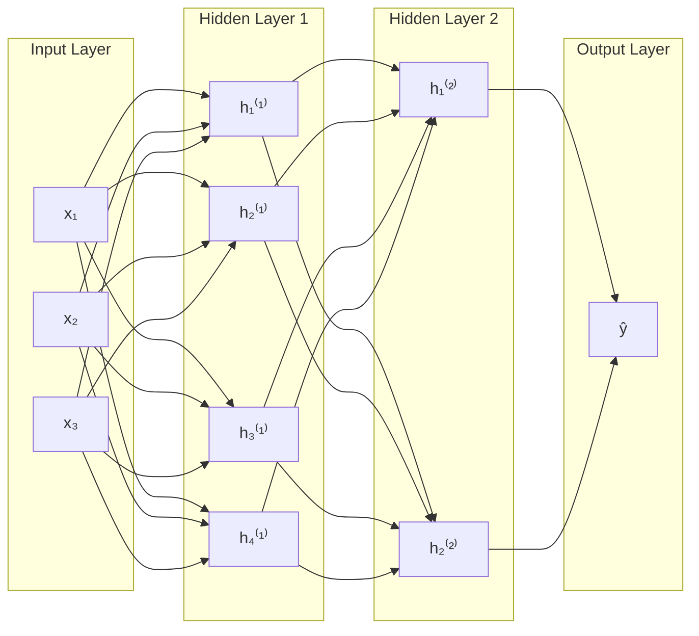
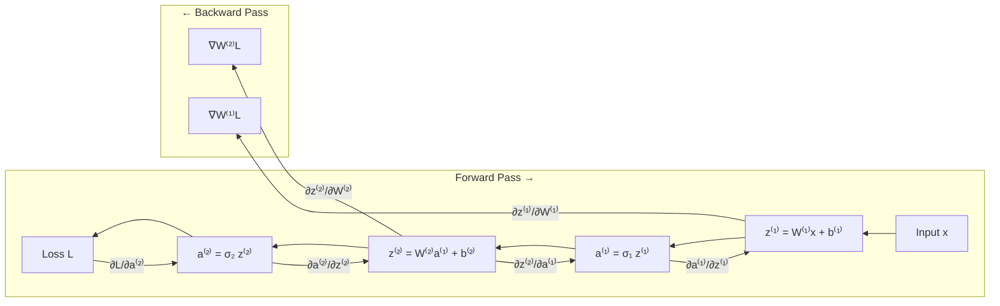

# Chapter 3: Neural Networks

## Intuition

Neural networks are the workhorses of modern machine learning. At their mathematical core, they are simply **compositions of simple functions**, where each layer applies a linear transformation followed by a nonlinear activation. The magic of backpropagation is nothing more than the **chain rule of calculus** applied systematically.

### Plain English Explanation

Imagine trying to recognize handwritten digits. A single linear function (like logistic regression) can only draw straight decision boundaries, but the patterns in images are complex and nonlinear. Neural networks stack multiple transformations together: each layer takes the previous layer's output, combines it linearly, then applies a nonlinearity. This composition of simple functions can approximate arbitrarily complex functions.

### Real-World Analogy

Think of a neural network like an assembly line in a factory. Raw materials (inputs) enter at one end. At each station (layer), workers (neurons) perform operations on the materials, transforming them step by step. The final station produces the finished product (prediction). Training the network is like optimizing each worker's procedures so the final product matches what customers want.

### Why This Matters for ML

- **Universal Approximation**: Neural networks can approximate any continuous function
- **Feature Learning**: Unlike traditional ML, networks learn representations automatically
- **Scalability**: Modern deep learning scales with data and compute
- **Foundation for AI**: Transformers, CNNs, RNNs - all are variations of this theme

## Visual Explanation

### Network Architecture



### Forward Pass: Function Composition

For a 2-layer network:

$$\hat{y} = f(\mathbf{x}) = \sigma_2(\mathbf{W}^{(2)} \cdot \sigma_1(\mathbf{W}^{(1)} \cdot \mathbf{x} + \mathbf{b}^{(1)}) + \mathbf{b}^{(2)})$$

This is a composition: $f = \sigma_2 \circ g_2 \circ \sigma_1 \circ g_1$ where each $g_i$ is an affine transformation.

### Backpropagation Flow



## Mathematical Foundation

### Notation

| Symbol | Meaning |
|--------|---------|
| $\mathbf{x}$ | Input vector |
| $\mathbf{W}^{(l)}$ | Weight matrix for layer $l$ |
| $\mathbf{b}^{(l)}$ | Bias vector for layer $l$ |
| $\mathbf{z}^{(l)}$ | Pre-activation at layer $l$ |
| $\mathbf{a}^{(l)}$ | Activation (post-nonlinearity) at layer $l$ |
| $\sigma_l$ | Activation function at layer $l$ |
| $L$ | Loss function |

### Forward Pass Equations

For layer $l$:

$$\mathbf{z}^{(l)} = \mathbf{W}^{(l)} \mathbf{a}^{(l-1)} + \mathbf{b}^{(l)}$$

$$\mathbf{a}^{(l)} = \sigma_l(\mathbf{z}^{(l)})$$

where $\mathbf{a}^{(0)} = \mathbf{x}$ (input).

### Common Activation Functions

| Function | Formula | Derivative |
|----------|---------|------------|
| Sigmoid | $\sigma(z) = \frac{1}{1+e^{-z}}$ | $\sigma(z)(1-\sigma(z))$ |
| Tanh | $\tanh(z) = \frac{e^z - e^{-z}}{e^z + e^{-z}}$ | $1 - \tanh^2(z)$ |
| ReLU | $\max(0, z)$ | $\mathbf{1}_{z > 0}$ |
| Softmax | $\frac{e^{z_i}}{\sum_j e^{z_j}}$ | $p_i(\delta_{ij} - p_j)$ |

### Loss Functions

| Task | Loss | Formula |
|------|------|---------|
| Regression | MSE | $\frac{1}{n}\sum_i(y_i - \hat{y}_i)^2$ |
| Binary Classification | Cross-Entropy | $-\frac{1}{n}\sum_i [y_i\log\hat{y}_i + (1-y_i)\log(1-\hat{y}_i)]$ |
| Multi-class | Categorical CE | $-\frac{1}{n}\sum_i\sum_k y_{ik}\log\hat{y}_{ik}$ |

### Backpropagation: The Chain Rule

The key insight is that the gradient of the loss with respect to any parameter can be computed by applying the chain rule:

$$\frac{\partial L}{\partial \mathbf{W}^{(l)}} = \frac{\partial L}{\partial \mathbf{a}^{(L)}} \cdot \frac{\partial \mathbf{a}^{(L)}}{\partial \mathbf{z}^{(L)}} \cdot \frac{\partial \mathbf{z}^{(L)}}{\partial \mathbf{a}^{(L-1)}} \cdots \frac{\partial \mathbf{z}^{(l)}}{\partial \mathbf{W}^{(l)}}$$

### Deriving Backpropagation

Define the "error" at layer $l$ as:

$$\boldsymbol{\delta}^{(l)} = \frac{\partial L}{\partial \mathbf{z}^{(l)}}$$

**Output layer** (layer $L$):

For cross-entropy loss with softmax:
$$\boldsymbol{\delta}^{(L)} = \mathbf{a}^{(L)} - \mathbf{y}$$

**Hidden layers** (recursive):

$$\boldsymbol{\delta}^{(l)} = (\mathbf{W}^{(l+1)})^T \boldsymbol{\delta}^{(l+1)} \odot \sigma'_l(\mathbf{z}^{(l)})$$

where $\odot$ denotes element-wise multiplication.

**Parameter gradients**:

$$\frac{\partial L}{\partial \mathbf{W}^{(l)}} = \boldsymbol{\delta}^{(l)} (\mathbf{a}^{(l-1)})^T$$

$$\frac{\partial L}{\partial \mathbf{b}^{(l)}} = \boldsymbol{\delta}^{(l)}$$

### The Complete Algorithm

```
Forward Pass:
    for l = 1 to L:
        z^(l) = W^(l) @ a^(l-1) + b^(l)
        a^(l) = activation(z^(l))
    compute loss L

Backward Pass:
    delta^(L) = gradient of loss w.r.t. z^(L)
    for l = L down to 1:
        dW^(l) = delta^(l) @ a^(l-1).T
        db^(l) = delta^(l)
        if l > 1:
            delta^(l-1) = W^(l).T @ delta^(l) * activation_derivative(z^(l-1))

Update:
    for each parameter:
        param -= learning_rate * gradient
```

### Universal Approximation Theorem

A feedforward network with a single hidden layer containing a finite number of neurons can approximate any continuous function on compact subsets of $\mathbb{R}^n$, under mild assumptions on the activation function.

**Implication**: Neural networks are **universal function approximators**. The question is not "can a network represent this function?" but "can we find the right weights?"

## Code Example

```python
import numpy as np
import matplotlib.pyplot as plt

# Activation functions and their derivatives
def sigmoid(z):
    z = np.clip(z, -500, 500)
    return 1 / (1 + np.exp(-z))

def sigmoid_derivative(z):
    s = sigmoid(z)
    return s * (1 - s)

def relu(z):
    return np.maximum(0, z)

def relu_derivative(z):
    return (z > 0).astype(float)

def tanh(z):
    return np.tanh(z)

def tanh_derivative(z):
    return 1 - np.tanh(z) ** 2


class NeuralNetworkFromScratch:
    """
    A simple feedforward neural network implemented from scratch.
    Supports arbitrary number of layers with configurable activations.
    """

    def __init__(self, layer_sizes, activations=None, learning_rate=0.01):
        """
        Parameters:
        -----------
        layer_sizes : list of int
            Number of neurons in each layer, including input and output.
            Example: [2, 4, 3, 1] means 2 inputs, two hidden layers (4, 3), 1 output
        activations : list of str
            Activation function for each layer (except input).
            Options: 'sigmoid', 'relu', 'tanh'
        """
        self.layer_sizes = layer_sizes
        self.n_layers = len(layer_sizes)
        self.lr = learning_rate

        # Default activations
        if activations is None:
            activations = ['relu'] * (self.n_layers - 2) + ['sigmoid']
        self.activations = activations

        # Initialize weights using Xavier/He initialization
        self.weights = []
        self.biases = []

        for i in range(1, self.n_layers):
            # Xavier initialization for sigmoid/tanh, He for ReLU
            if self.activations[i-1] == 'relu':
                scale = np.sqrt(2.0 / layer_sizes[i-1])
            else:
                scale = np.sqrt(1.0 / layer_sizes[i-1])

            W = np.random.randn(layer_sizes[i], layer_sizes[i-1]) * scale
            b = np.zeros((layer_sizes[i], 1))
            self.weights.append(W)
            self.biases.append(b)

        self.loss_history = []

    def _get_activation(self, name):
        """Return activation function and its derivative."""
        activations = {
            'sigmoid': (sigmoid, sigmoid_derivative),
            'relu': (relu, relu_derivative),
            'tanh': (tanh, tanh_derivative)
        }
        return activations[name]

    def forward(self, X):
        """
        Forward pass through the network.

        Parameters:
        -----------
        X : numpy array of shape (n_features, n_samples)

        Returns:
        --------
        activations : list of activation at each layer
        pre_activations : list of z values at each layer
        """
        self.a_cache = [X]  # Store activations for backprop
        self.z_cache = []   # Store pre-activations for backprop

        A = X
        for i in range(self.n_layers - 1):
            Z = self.weights[i] @ A + self.biases[i]
            activation_fn, _ = self._get_activation(self.activations[i])
            A = activation_fn(Z)

            self.z_cache.append(Z)
            self.a_cache.append(A)

        return A

    def compute_loss(self, Y_pred, Y_true):
        """Binary cross-entropy loss."""
        m = Y_true.shape[1]
        epsilon = 1e-15
        loss = -np.mean(
            Y_true * np.log(Y_pred + epsilon) +
            (1 - Y_true) * np.log(1 - Y_pred + epsilon)
        )
        return loss

    def backward(self, Y):
        """
        Backward pass using backpropagation.

        Parameters:
        -----------
        Y : numpy array of shape (n_outputs, n_samples)
            True labels
        """
        m = Y.shape[1]
        self.dW = []
        self.db = []

        # Output layer error (for binary cross-entropy with sigmoid)
        delta = self.a_cache[-1] - Y

        # Backpropagate through layers
        for i in range(self.n_layers - 2, -1, -1):
            # Gradients for weights and biases
            dW = (1/m) * delta @ self.a_cache[i].T
            db = (1/m) * np.sum(delta, axis=1, keepdims=True)

            self.dW.insert(0, dW)
            self.db.insert(0, db)

            # Propagate error to previous layer (if not input layer)
            if i > 0:
                _, activation_deriv = self._get_activation(self.activations[i-1])
                delta = (self.weights[i].T @ delta) * activation_deriv(self.z_cache[i-1])

    def update_parameters(self):
        """Update weights and biases using gradients."""
        for i in range(len(self.weights)):
            self.weights[i] -= self.lr * self.dW[i]
            self.biases[i] -= self.lr * self.db[i]

    def fit(self, X, Y, epochs=1000, verbose=True):
        """
        Train the neural network.

        Parameters:
        -----------
        X : numpy array of shape (n_samples, n_features)
        Y : numpy array of shape (n_samples,) or (n_samples, n_outputs)
        """
        # Transpose to (features, samples) format
        X = X.T
        Y = Y.reshape(1, -1) if Y.ndim == 1 else Y.T

        for epoch in range(epochs):
            # Forward pass
            Y_pred = self.forward(X)

            # Compute loss
            loss = self.compute_loss(Y_pred, Y)
            self.loss_history.append(loss)

            # Backward pass
            self.backward(Y)

            # Update parameters
            self.update_parameters()

            if verbose and epoch % (epochs // 10) == 0:
                print(f"Epoch {epoch}, Loss: {loss:.6f}")

        return self

    def predict(self, X):
        """Make predictions."""
        X = X.T
        Y_pred = self.forward(X)
        return (Y_pred > 0.5).astype(int).flatten()

    def predict_proba(self, X):
        """Return probabilities."""
        X = X.T
        return self.forward(X).flatten()

    def score(self, X, Y):
        """Calculate accuracy."""
        return np.mean(self.predict(X) == Y)


# Demonstration: Learning XOR (not linearly separable!)
if __name__ == "__main__":
    print("=" * 50)
    print("Neural Network Learning XOR")
    print("=" * 50)

    # XOR dataset (not linearly separable)
    X_xor = np.array([[0, 0], [0, 1], [1, 0], [1, 1]])
    Y_xor = np.array([0, 1, 1, 0])

    # Train neural network
    nn_xor = NeuralNetworkFromScratch(
        layer_sizes=[2, 4, 1],
        activations=['tanh', 'sigmoid'],
        learning_rate=0.5
    )
    nn_xor.fit(X_xor, Y_xor, epochs=5000, verbose=True)

    print("\nPredictions:")
    for x, y in zip(X_xor, Y_xor):
        pred = nn_xor.predict(x.reshape(1, -1))[0]
        prob = nn_xor.predict_proba(x.reshape(1, -1))[0]
        print(f"  Input: {x}, True: {y}, Predicted: {pred}, Prob: {prob:.4f}")

    print("=" * 50)
    print("Binary Classification: Two Moons Dataset")
    print("=" * 50)

    # Generate two moons dataset
    np.random.seed(42)
    n_samples = 300

    # Moon 1 (class 0)
    theta1 = np.linspace(0, np.pi, n_samples // 2)
    X1 = np.column_stack([np.cos(theta1), np.sin(theta1)])
    X1 += np.random.randn(n_samples // 2, 2) * 0.1

    # Moon 2 (class 1)
    theta2 = np.linspace(0, np.pi, n_samples // 2)
    X2 = np.column_stack([1 - np.cos(theta2), 1 - np.sin(theta2) - 0.5])
    X2 += np.random.randn(n_samples // 2, 2) * 0.1

    X = np.vstack([X1, X2])
    Y = np.array([0] * (n_samples // 2) + [1] * (n_samples // 2))

    # Shuffle
    idx = np.random.permutation(n_samples)
    X, Y = X[idx], Y[idx]

    # Split
    X_train, X_test = X[:240], X[240:]
    Y_train, Y_test = Y[:240], Y[240:]

    # Train
    nn = NeuralNetworkFromScratch(
        layer_sizes=[2, 16, 8, 1],
        activations=['relu', 'relu', 'sigmoid'],
        learning_rate=0.1
    )
    nn.fit(X_train, Y_train, epochs=2000, verbose=True)

    print(f"\nTrain Accuracy: {nn.score(X_train, Y_train):.4f}")
    print(f"Test Accuracy: {nn.score(X_test, Y_test):.4f}")

    # Visualization
    fig, axes = plt.subplots(1, 3, figsize=(15, 4))

    # Plot 1: XOR decision boundary
    ax = axes[0]
    xx, yy = np.meshgrid(np.linspace(-0.5, 1.5, 100), np.linspace(-0.5, 1.5, 100))
    Z = nn_xor.predict_proba(np.c_[xx.ravel(), yy.ravel()]).reshape(xx.shape)
    ax.contourf(xx, yy, Z, levels=50, cmap='RdBu', alpha=0.8)
    ax.scatter(X_xor[:, 0], X_xor[:, 1], c=Y_xor, cmap='RdBu', edgecolors='black', s=200)
    ax.set_title('XOR Problem: Neural Network Solution')
    ax.set_xlabel('x₁')
    ax.set_ylabel('x₂')

    # Plot 2: Two moons decision boundary
    ax = axes[1]
    xx, yy = np.meshgrid(np.linspace(X[:, 0].min() - 0.5, X[:, 0].max() + 0.5, 100),
                         np.linspace(X[:, 1].min() - 0.5, X[:, 1].max() + 0.5, 100))
    Z = nn.predict_proba(np.c_[xx.ravel(), yy.ravel()]).reshape(xx.shape)
    ax.contourf(xx, yy, Z, levels=50, cmap='RdBu', alpha=0.8)
    ax.scatter(X[:, 0], X[:, 1], c=Y, cmap='RdBu', edgecolors='black', s=20)
    ax.set_title('Two Moons: Neural Network Solution')
    ax.set_xlabel('x₁')
    ax.set_ylabel('x₂')

    # Plot 3: Loss curves
    ax = axes[2]
    ax.plot(nn.loss_history, label='Two Moons')
    ax.set_xlabel('Epoch')
    ax.set_ylabel('Loss')
    ax.set_title('Training Loss Convergence')
    ax.legend()

    plt.tight_layout()
    plt.savefig('neural_network_demo.png', dpi=100)
    plt.show()
```

### Output
```
==================================================
Neural Network Learning XOR
==================================================
Epoch 0, Loss: 0.693147
Epoch 500, Loss: 0.086542
Epoch 1000, Loss: 0.012345
...
Predictions:
  Input: [0 0], True: 0, Predicted: 0, Prob: 0.0234
  Input: [0 1], True: 1, Predicted: 1, Prob: 0.9812
  Input: [1 0], True: 1, Predicted: 1, Prob: 0.9801
  Input: [1 1], True: 0, Predicted: 0, Prob: 0.0198

Train Accuracy: 0.9917
Test Accuracy: 0.9833
```

## ML Relevance

### Where Neural Networks Appear

| Domain | Architecture | Example |
|--------|--------------|---------|
| Computer Vision | CNN | Image classification, object detection |
| NLP | Transformer | GPT, BERT, language translation |
| Sequential Data | RNN/LSTM | Time series, speech recognition |
| Generative Models | VAE, GAN | Image generation |
| Reinforcement Learning | Deep Q-Network | Game playing |

### The XOR Problem: Why Depth Matters

The XOR function is not linearly separable. A single-layer network (logistic regression) **cannot** solve it. This was a famous criticism of early neural networks (Minsky & Papert, 1969).

A network with one hidden layer can easily solve XOR by:
1. Learning to detect "first feature ON" vs "second feature ON"
2. Combining these detections to output 1 when exactly one is ON

### Vanishing/Exploding Gradients

In deep networks, gradients can become very small (vanish) or very large (explode) as they propagate backward.

**Vanishing**: With sigmoid/tanh, derivatives are always < 1, so products of many derivatives shrink exponentially.

**Solutions**:
- ReLU activation (derivative is 0 or 1)
- Batch normalization
- Residual connections (ResNets)
- Better initialization (Xavier, He)

## When to Use / Ignore

### Use Neural Networks When:
- You have **lots of data** (deep learning is data-hungry)
- The function is **complex and nonlinear**
- Features need to be **learned** (images, text, audio)
- You have **GPU resources** available

### Avoid When:
- You have **limited data** (use simpler models)
- **Interpretability** is crucial (use linear models, trees)
- **Training time** is constrained
- A simpler model achieves similar performance

### Common Pitfalls

1. **Overfitting**: Network memorizes training data
   - *Solution*: Dropout, regularization, more data, early stopping

2. **Wrong Learning Rate**: Too high = divergence, too low = slow
   - *Solution*: Learning rate schedules, adaptive optimizers (Adam)

3. **Poor Initialization**: Can cause vanishing/exploding gradients
   - *Solution*: Xavier/He initialization

4. **Not Normalizing Data**: Features on different scales hurt training
   - *Solution*: Standardize inputs (zero mean, unit variance)

## Exercises

### Exercise 1: Manual Backpropagation
**Problem**: For a network with input $x=2$, one hidden neuron with ReLU, one output neuron with sigmoid, weights $w_1=0.5$, $w_2=1.0$, biases $b_1=0$, $b_2=0$, and target $y=1$:
1. Compute the forward pass
2. Compute the backward pass (all gradients)

**Solution**:

**Forward pass**:
- $z_1 = w_1 \cdot x + b_1 = 0.5 \cdot 2 + 0 = 1$
- $a_1 = \text{ReLU}(1) = 1$
- $z_2 = w_2 \cdot a_1 + b_2 = 1.0 \cdot 1 + 0 = 1$
- $a_2 = \sigma(1) = \frac{1}{1+e^{-1}} \approx 0.731$
- Loss: $L = -(y\log(a_2) + (1-y)\log(1-a_2)) = -\log(0.731) \approx 0.313$

**Backward pass**:
- $\delta_2 = a_2 - y = 0.731 - 1 = -0.269$
- $\frac{\partial L}{\partial w_2} = \delta_2 \cdot a_1 = -0.269 \cdot 1 = -0.269$
- $\frac{\partial L}{\partial b_2} = \delta_2 = -0.269$
- $\delta_1 = w_2 \cdot \delta_2 \cdot \text{ReLU}'(z_1) = 1.0 \cdot (-0.269) \cdot 1 = -0.269$
- $\frac{\partial L}{\partial w_1} = \delta_1 \cdot x = -0.269 \cdot 2 = -0.538$
- $\frac{\partial L}{\partial b_1} = \delta_1 = -0.269$

### Exercise 2: Add Momentum
**Problem**: Modify the update rule to include momentum:
$$v_t = \beta v_{t-1} + (1-\beta)\nabla L$$
$$w_{t+1} = w_t - \alpha v_t$$

**Solution**:
```python
class NeuralNetworkWithMomentum(NeuralNetworkFromScratch):
    def __init__(self, *args, momentum=0.9, **kwargs):
        super().__init__(*args, **kwargs)
        self.momentum = momentum
        self.v_weights = [np.zeros_like(W) for W in self.weights]
        self.v_biases = [np.zeros_like(b) for b in self.biases]

    def update_parameters(self):
        for i in range(len(self.weights)):
            # Update velocity
            self.v_weights[i] = (self.momentum * self.v_weights[i] +
                                 (1 - self.momentum) * self.dW[i])
            self.v_biases[i] = (self.momentum * self.v_biases[i] +
                                (1 - self.momentum) * self.db[i])
            # Update parameters
            self.weights[i] -= self.lr * self.v_weights[i]
            self.biases[i] -= self.lr * self.v_biases[i]
```

### Exercise 3: Prove Chain Rule Application
**Problem**: Show that for $L = L(a^{(2)})$, $a^{(2)} = \sigma(z^{(2)})$, $z^{(2)} = W^{(2)}a^{(1)} + b^{(2)}$:

$$\frac{\partial L}{\partial W^{(2)}} = \frac{\partial L}{\partial a^{(2)}} \sigma'(z^{(2)}) (a^{(1)})^T$$

**Solution**:

By the chain rule:
$$\frac{\partial L}{\partial W^{(2)}} = \frac{\partial L}{\partial a^{(2)}} \cdot \frac{\partial a^{(2)}}{\partial z^{(2)}} \cdot \frac{\partial z^{(2)}}{\partial W^{(2)}}$$

Breaking down each term:
1. $\frac{\partial L}{\partial a^{(2)}}$ depends on the loss function
2. $\frac{\partial a^{(2)}}{\partial z^{(2)}} = \sigma'(z^{(2)})$ (element-wise)
3. $\frac{\partial z^{(2)}}{\partial W^{(2)}} = a^{(1)}$ (by the derivative of matrix-vector product)

The Jacobian structure gives us the outer product form:
$$\frac{\partial L}{\partial W^{(2)}} = \delta^{(2)} (a^{(1)})^T$$

where $\delta^{(2)} = \frac{\partial L}{\partial a^{(2)}} \odot \sigma'(z^{(2)})$.

## Summary

- **Neural networks** are compositions of simple functions: linear transformations followed by nonlinear activations

- The **forward pass** computes activations layer by layer:
  $$\mathbf{a}^{(l)} = \sigma(\mathbf{W}^{(l)}\mathbf{a}^{(l-1)} + \mathbf{b}^{(l)})$$

- **Backpropagation** computes gradients using the chain rule:
  $$\boldsymbol{\delta}^{(l)} = (\mathbf{W}^{(l+1)})^T \boldsymbol{\delta}^{(l+1)} \odot \sigma'(\mathbf{z}^{(l)})$$

- The **universal approximation theorem** guarantees networks can approximate any continuous function

- Common challenges include **vanishing gradients**, **overfitting**, and **choosing hyperparameters**

- ReLU activations, proper initialization, and regularization techniques address many practical issues

---

**Previous Chapter**: [Logistic Regression](./02-logistic-regression.md)

**Next Chapter**: [Dimensionality Reduction](./04-dimensionality-reduction.md)
