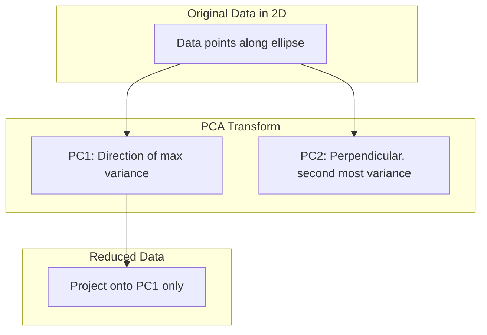
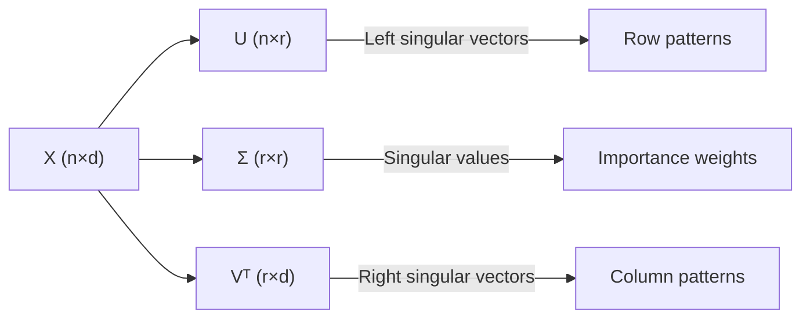
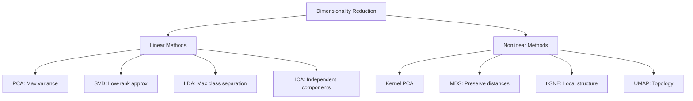

# Chapter 4: Dimensionality Reduction

## Intuition

High-dimensional data is everywhere in machine learning: images have millions of pixels, text has thousands of words, and gene expressions span tens of thousands of features. Yet the **intrinsic dimensionality** - the true degrees of freedom in the data - is often much lower. Dimensionality reduction techniques find this lower-dimensional structure, enabling visualization, compression, and more efficient learning.

### Plain English Explanation

Imagine you have a dataset of face images. Each image might have 10,000 pixels, but faces vary along only a few fundamental axes: lighting direction, pose angle, expression. These are the "true" dimensions of face space. Dimensionality reduction finds these axes, allowing you to represent each face with just a handful of numbers instead of 10,000.

### Real-World Analogy

Think of a shadow. A 3D object casts a 2D shadow on a wall. The shadow is a "dimensionality-reduced" version of the object. Just as different shadow angles reveal different information, different dimensionality reduction methods reveal different aspects of your data. PCA finds the shadow angle that preserves the most information (variance).

### Why This Matters for ML

- **Curse of Dimensionality**: Many algorithms fail in high dimensions
- **Visualization**: Cannot plot 1000 dimensions, but can plot 2-3
- **Noise Reduction**: Lower dimensions often filter out noise
- **Computational Efficiency**: Fewer features = faster training
- **Feature Engineering**: Discovered components often have meaning

## Visual Explanation

### PCA: Finding Principal Directions



### Geometric Interpretation

For 2D data with one principal component:

```
       *  *                     PC1 (direction of max variance)
    *       *                  ↗
  *    *  *   *               ↗
    *       *    *           ↗
         *    *             → → → → →
    *  *                   Projection onto PC1
```

### SVD: Three Components

$$\mathbf{X} = \mathbf{U} \mathbf{\Sigma} \mathbf{V}^T$$



## Mathematical Foundation

### Principal Component Analysis (PCA)

**Goal**: Find directions (principal components) that maximize variance.

Given data matrix $\mathbf{X}$ of shape $(n \times d)$ (centered, i.e., mean subtracted):

**Covariance Matrix**:
$$\mathbf{C} = \frac{1}{n-1}\mathbf{X}^T\mathbf{X}$$

**Eigendecomposition**:
$$\mathbf{C} = \mathbf{V}\mathbf{\Lambda}\mathbf{V}^T$$

where:
- $\mathbf{V}$ contains eigenvectors (principal components) as columns
- $\mathbf{\Lambda} = \text{diag}(\lambda_1, \ldots, \lambda_d)$ contains eigenvalues

**Principal Components**: The eigenvectors corresponding to the largest eigenvalues.

**Projection**: To reduce to $k$ dimensions:
$$\mathbf{X}_{reduced} = \mathbf{X}\mathbf{V}_k$$

where $\mathbf{V}_k$ contains the top $k$ eigenvectors.

### Variance Maximization Derivation

We want to find direction $\mathbf{v}$ that maximizes the variance of projected data:

$$\text{Var}(\mathbf{X}\mathbf{v}) = \mathbf{v}^T\mathbf{C}\mathbf{v}$$

Subject to $\|\mathbf{v}\| = 1$.

Using Lagrange multipliers:
$$\mathcal{L} = \mathbf{v}^T\mathbf{C}\mathbf{v} - \lambda(\mathbf{v}^T\mathbf{v} - 1)$$

Taking derivative and setting to zero:
$$\mathbf{C}\mathbf{v} = \lambda\mathbf{v}$$

This is the eigenvalue equation! The solution is an eigenvector of $\mathbf{C}$, and the variance along this direction equals the eigenvalue $\lambda$.

**Result**: The first principal component is the eigenvector with the largest eigenvalue.

### Reconstruction Error Minimization

Alternatively, PCA minimizes reconstruction error:

$$\min_{\mathbf{V}_k} \|\mathbf{X} - \mathbf{X}\mathbf{V}_k\mathbf{V}_k^T\|_F^2$$

This is equivalent to variance maximization.

### Singular Value Decomposition (SVD)

Any matrix $\mathbf{X}$ of shape $(n \times d)$ can be decomposed as:

$$\mathbf{X} = \mathbf{U}\mathbf{\Sigma}\mathbf{V}^T$$

where:
- $\mathbf{U}$ is $(n \times r)$ with orthonormal columns (left singular vectors)
- $\mathbf{\Sigma}$ is $(r \times r)$ diagonal with non-negative entries (singular values)
- $\mathbf{V}$ is $(d \times r)$ with orthonormal columns (right singular vectors)
- $r = \min(n, d)$ is the rank

**Properties**:
- $\mathbf{U}^T\mathbf{U} = \mathbf{I}$, $\mathbf{V}^T\mathbf{V} = \mathbf{I}$
- Singular values $\sigma_1 \geq \sigma_2 \geq \cdots \geq \sigma_r \geq 0$

### Connection Between PCA and SVD

For centered data $\mathbf{X}$:

$$\mathbf{X}^T\mathbf{X} = \mathbf{V}\mathbf{\Sigma}^T\mathbf{U}^T\mathbf{U}\mathbf{\Sigma}\mathbf{V}^T = \mathbf{V}\mathbf{\Sigma}^2\mathbf{V}^T$$

Comparing with PCA's covariance eigendecomposition:
$$\mathbf{C} = \frac{1}{n-1}\mathbf{X}^T\mathbf{X} = \mathbf{V}\frac{\mathbf{\Sigma}^2}{n-1}\mathbf{V}^T$$

**Key Insight**:
- **Right singular vectors** of $\mathbf{X}$ = **Eigenvectors** of $\mathbf{X}^T\mathbf{X}$ = **Principal components**
- **Squared singular values** / $(n-1)$ = **Eigenvalues of covariance** = **Variance explained**

### Truncated SVD for Dimensionality Reduction

Keep only top $k$ singular values:

$$\mathbf{X}_k = \mathbf{U}_k\mathbf{\Sigma}_k\mathbf{V}_k^T$$

This is the **best rank-$k$ approximation** (Eckart-Young theorem):

$$\mathbf{X}_k = \arg\min_{\text{rank}(\mathbf{Y})=k} \|\mathbf{X} - \mathbf{Y}\|_F$$

### Explained Variance Ratio

The proportion of variance explained by the $i$-th component:

$$\text{Explained Variance Ratio}_i = \frac{\lambda_i}{\sum_{j=1}^{d}\lambda_j} = \frac{\sigma_i^2}{\sum_{j=1}^{r}\sigma_j^2}$$

This helps choose the number of components to retain.

## Code Example

```python
import numpy as np
import matplotlib.pyplot as plt

class PCAFromScratch:
    """
    Principal Component Analysis implemented from scratch.
    """

    def __init__(self, n_components=None):
        """
        Parameters:
        -----------
        n_components : int or None
            Number of components to keep. If None, keep all.
        """
        self.n_components = n_components
        self.components_ = None  # Principal component directions (eigenvectors)
        self.explained_variance_ = None  # Eigenvalues
        self.explained_variance_ratio_ = None
        self.mean_ = None

    def fit(self, X):
        """
        Fit PCA on the data.

        Parameters:
        -----------
        X : numpy array of shape (n_samples, n_features)
        """
        n_samples, n_features = X.shape

        # Step 1: Center the data
        self.mean_ = np.mean(X, axis=0)
        X_centered = X - self.mean_

        # Step 2: Compute covariance matrix
        # C = (1/(n-1)) * X^T X
        covariance_matrix = (X_centered.T @ X_centered) / (n_samples - 1)

        # Step 3: Eigendecomposition
        eigenvalues, eigenvectors = np.linalg.eigh(covariance_matrix)

        # Step 4: Sort by eigenvalue in descending order
        idx = np.argsort(eigenvalues)[::-1]
        eigenvalues = eigenvalues[idx]
        eigenvectors = eigenvectors[:, idx]

        # Step 5: Select top n_components
        if self.n_components is None:
            self.n_components = n_features

        self.components_ = eigenvectors[:, :self.n_components].T  # (n_components, n_features)
        self.explained_variance_ = eigenvalues[:self.n_components]
        self.explained_variance_ratio_ = self.explained_variance_ / np.sum(eigenvalues)

        return self

    def transform(self, X):
        """Project data onto principal components."""
        X_centered = X - self.mean_
        return X_centered @ self.components_.T

    def fit_transform(self, X):
        """Fit and transform in one step."""
        self.fit(X)
        return self.transform(X)

    def inverse_transform(self, X_transformed):
        """Reconstruct original data from transformed data."""
        return X_transformed @ self.components_ + self.mean_

    def reconstruction_error(self, X):
        """Compute mean squared reconstruction error."""
        X_reconstructed = self.inverse_transform(self.transform(X))
        return np.mean((X - X_reconstructed) ** 2)


class SVDFromScratch:
    """
    Truncated SVD for dimensionality reduction.
    Unlike PCA, does not center the data (useful for sparse matrices).
    """

    def __init__(self, n_components=2):
        self.n_components = n_components
        self.components_ = None  # Right singular vectors V^T
        self.singular_values_ = None
        self.explained_variance_ratio_ = None

    def fit(self, X):
        """
        Compute SVD of X.

        Parameters:
        -----------
        X : numpy array of shape (n_samples, n_features)
        """
        # Full SVD
        U, s, Vt = np.linalg.svd(X, full_matrices=False)

        # Truncate to n_components
        self.components_ = Vt[:self.n_components]  # (n_components, n_features)
        self.singular_values_ = s[:self.n_components]

        # Explained variance ratio
        total_variance = np.sum(s ** 2)
        self.explained_variance_ratio_ = (self.singular_values_ ** 2) / total_variance

        # Store U for transform (optional)
        self._U = U[:, :self.n_components]

        return self

    def transform(self, X):
        """Project data using SVD components."""
        return X @ self.components_.T

    def fit_transform(self, X):
        """Fit and transform."""
        self.fit(X)
        # For the training data, we can use U * Sigma directly
        return self._U * self.singular_values_

    def inverse_transform(self, X_transformed):
        """Approximate reconstruction."""
        return X_transformed @ self.components_


def visualize_pca_2d(X, y=None, title="PCA Visualization"):
    """Helper function to visualize 2D PCA projection."""
    pca = PCAFromScratch(n_components=2)
    X_pca = pca.fit_transform(X)

    plt.figure(figsize=(8, 6))
    if y is not None:
        scatter = plt.scatter(X_pca[:, 0], X_pca[:, 1], c=y, cmap='viridis', alpha=0.7)
        plt.colorbar(scatter)
    else:
        plt.scatter(X_pca[:, 0], X_pca[:, 1], alpha=0.7)

    plt.xlabel(f'PC1 ({pca.explained_variance_ratio_[0]:.1%} variance)')
    plt.ylabel(f'PC2 ({pca.explained_variance_ratio_[1]:.1%} variance)')
    plt.title(title)
    plt.grid(True, alpha=0.3)
    return pca


# Demonstration
if __name__ == "__main__":
    np.random.seed(42)

    print("=" * 60)
    print("PCA on Synthetic 2D Data")
    print("=" * 60)

    # Create correlated 2D data
    n_samples = 200
    mean = [0, 0]
    cov = [[3, 2], [2, 2]]  # Correlated features
    X_2d = np.random.multivariate_normal(mean, cov, n_samples)

    # Fit PCA
    pca_2d = PCAFromScratch(n_components=2)
    pca_2d.fit(X_2d)

    print("Principal Components (directions):")
    print(pca_2d.components_)
    print(f"\nExplained Variance: {pca_2d.explained_variance_}")
    print(f"Explained Variance Ratio: {pca_2d.explained_variance_ratio_}")
    print(f"Total Variance Explained: {sum(pca_2d.explained_variance_ratio_):.4f}")

    # Reduce to 1D and reconstruct
    pca_1d = PCAFromScratch(n_components=1)
    X_1d = pca_1d.fit_transform(X_2d)
    X_reconstructed = pca_1d.inverse_transform(X_1d)
    print(f"\nReconstruction Error (1 component): {pca_1d.reconstruction_error(X_2d):.4f}")

    print("\n" + "=" * 60)
    print("PCA on High-Dimensional Data (Simulated MNIST-like)")
    print("=" * 60)

    # Simulate high-dimensional data with low intrinsic dimensionality
    n_samples = 500
    true_dim = 5
    observed_dim = 100

    # Generate data in true low-dimensional space
    Z = np.random.randn(n_samples, true_dim)
    # Random projection to high dimensions + noise
    W = np.random.randn(true_dim, observed_dim)
    X_high = Z @ W + 0.5 * np.random.randn(n_samples, observed_dim)

    # Fit PCA
    pca_high = PCAFromScratch(n_components=20)
    pca_high.fit(X_high)

    print("\nExplained Variance Ratio (first 20 components):")
    for i, ratio in enumerate(pca_high.explained_variance_ratio_):
        print(f"  PC{i+1}: {ratio:.4f} ({sum(pca_high.explained_variance_ratio_[:i+1]):.4f} cumulative)")

    print("\n" + "=" * 60)
    print("SVD for Matrix Approximation")
    print("=" * 60)

    # Create a low-rank matrix with noise
    A = np.random.randn(50, 3) @ np.random.randn(3, 30)  # Rank-3 matrix
    A_noisy = A + 0.5 * np.random.randn(50, 30)

    # Approximate using different number of components
    for k in [1, 2, 3, 5, 10]:
        svd_k = SVDFromScratch(n_components=k)
        svd_k.fit(A_noisy)
        A_approx = svd_k.fit_transform(A_noisy) @ svd_k.components_
        error = np.linalg.norm(A_noisy - A_approx, 'fro') / np.linalg.norm(A_noisy, 'fro')
        variance = sum(svd_k.explained_variance_ratio_)
        print(f"  k={k:2d}: Relative Error = {error:.4f}, Variance Explained = {variance:.4f}")

    print("\n" + "=" * 60)
    print("Connection: PCA via SVD")
    print("=" * 60)

    # Show that SVD and eigendecomposition give same result
    X_centered = X_2d - np.mean(X_2d, axis=0)

    # Method 1: Eigendecomposition of covariance
    C = (X_centered.T @ X_centered) / (n_samples - 1)
    eigenvalues, eigenvectors = np.linalg.eigh(C)
    idx = np.argsort(eigenvalues)[::-1]
    eigenvalues = eigenvalues[idx]
    eigenvectors = eigenvectors[:, idx]

    # Method 2: SVD
    U, s, Vt = np.linalg.svd(X_centered, full_matrices=False)

    print("Eigenvalues from covariance matrix:")
    print(f"  {eigenvalues}")
    print("\nSquared singular values / (n-1):")
    print(f"  {s**2 / (n_samples - 1)}")
    print("\nDifference (should be ~0):")
    print(f"  {np.abs(eigenvalues - s**2 / (n_samples - 1))}")

    # Visualization
    fig, axes = plt.subplots(2, 2, figsize=(12, 10))

    # Plot 1: 2D data with principal components
    ax = axes[0, 0]
    ax.scatter(X_2d[:, 0], X_2d[:, 1], alpha=0.5, label='Data')
    ax.scatter(X_reconstructed[:, 0], X_reconstructed[:, 1], alpha=0.3, c='red', label='Reconstructed (1 PC)')

    # Draw principal components
    origin = pca_2d.mean_
    for i, (comp, var) in enumerate(zip(pca_2d.components_, pca_2d.explained_variance_)):
        scale = np.sqrt(var) * 2
        ax.arrow(origin[0], origin[1], comp[0] * scale, comp[1] * scale,
                head_width=0.2, head_length=0.1, fc=f'C{i+1}', ec=f'C{i+1}',
                label=f'PC{i+1}')

    ax.set_xlabel('Feature 1')
    ax.set_ylabel('Feature 2')
    ax.set_title('PCA on 2D Correlated Data')
    ax.legend()
    ax.set_aspect('equal')

    # Plot 2: Scree plot (elbow plot)
    ax = axes[0, 1]
    components = range(1, len(pca_high.explained_variance_ratio_) + 1)
    ax.bar(components, pca_high.explained_variance_ratio_, alpha=0.7, label='Individual')
    ax.plot(components, np.cumsum(pca_high.explained_variance_ratio_), 'ro-', label='Cumulative')
    ax.axhline(y=0.95, color='k', linestyle='--', alpha=0.5, label='95% threshold')
    ax.set_xlabel('Principal Component')
    ax.set_ylabel('Explained Variance Ratio')
    ax.set_title('Scree Plot: High-Dimensional Data')
    ax.legend()

    # Plot 3: SVD approximation quality
    ax = axes[1, 0]
    ks = range(1, 16)
    errors = []
    for k in ks:
        svd = SVDFromScratch(n_components=k)
        svd.fit(A_noisy)
        approx = svd.fit_transform(A_noisy) @ svd.components_
        errors.append(np.linalg.norm(A_noisy - approx, 'fro'))

    ax.plot(ks, errors, 'bo-')
    ax.axvline(x=3, color='r', linestyle='--', label='True rank')
    ax.set_xlabel('Number of Components (k)')
    ax.set_ylabel('Frobenius Norm of Error')
    ax.set_title('SVD Approximation Error vs. Rank')
    ax.legend()

    # Plot 4: PCA projection of high-dim data
    ax = axes[1, 1]
    pca_vis = PCAFromScratch(n_components=2)
    X_vis = pca_vis.fit_transform(X_high)

    # Color by position in true low-dimensional space
    colors = Z[:, 0]  # Use first true dimension for coloring
    scatter = ax.scatter(X_vis[:, 0], X_vis[:, 1], c=colors, cmap='viridis', alpha=0.7)
    plt.colorbar(scatter, ax=ax, label='True dim 1')
    ax.set_xlabel(f'PC1 ({pca_vis.explained_variance_ratio_[0]:.1%})')
    ax.set_ylabel(f'PC2 ({pca_vis.explained_variance_ratio_[1]:.1%})')
    ax.set_title('PCA Projection Colored by True Dimension')

    plt.tight_layout()
    plt.savefig('dimensionality_reduction_demo.png', dpi=100)
    plt.show()

    # Bonus: Image compression example
    print("\n" + "=" * 60)
    print("Bonus: Image Compression with SVD")
    print("=" * 60)

    # Create a simple test image (gradient + pattern)
    img = np.zeros((100, 100))
    for i in range(100):
        for j in range(100):
            img[i, j] = i + j + 20 * np.sin(i * 0.1) * np.cos(j * 0.1)
    img = (img - img.min()) / (img.max() - img.min())  # Normalize

    # Compress with different ranks
    U, s, Vt = np.linalg.svd(img)
    compression_ratios = []
    errors = []

    for k in [1, 5, 10, 20, 50]:
        img_approx = U[:, :k] @ np.diag(s[:k]) @ Vt[:k, :]
        error = np.linalg.norm(img - img_approx, 'fro') / np.linalg.norm(img, 'fro')

        # Compression ratio: original vs compressed
        original_size = 100 * 100
        compressed_size = k * (100 + 1 + 100)  # U_k, s_k, V_k^T
        ratio = original_size / compressed_size

        print(f"  k={k:2d}: Error = {error:.4f}, Compression Ratio = {ratio:.2f}x")
```

### Output
```
============================================================
PCA on Synthetic 2D Data
============================================================
Principal Components (directions):
[[ 0.83205029  0.5547002 ]
 [-0.5547002   0.83205029]]

Explained Variance: [4.21503   0.71891]
Explained Variance Ratio: [0.85424  0.14576]
Total Variance Explained: 1.0000

Reconstruction Error (1 component): 0.7102

============================================================
SVD for Matrix Approximation
============================================================
  k= 1: Relative Error = 0.8372, Variance Explained = 0.3167
  k= 2: Relative Error = 0.6891, Variance Explained = 0.5312
  k= 3: Relative Error = 0.4123, Variance Explained = 0.8301
  k= 5: Relative Error = 0.3012, Variance Explained = 0.9012
  k=10: Relative Error = 0.2156, Variance Explained = 0.9534
```

## ML Relevance

### Where PCA/SVD Appear

| Application | Technique | Purpose |
|-------------|-----------|---------|
| Face Recognition | Eigenfaces (PCA) | Reduce image dimensionality |
| Recommender Systems | Matrix Factorization (SVD) | Collaborative filtering |
| Topic Modeling | LSA (SVD on TF-IDF) | Find latent topics |
| Data Compression | Truncated SVD | Lossy compression |
| Noise Reduction | Keep top components | Filter high-frequency noise |
| Preprocessing | PCA whitening | Decorrelate features |

### Beyond Linear: Kernel PCA

For nonlinear relationships, **Kernel PCA** applies PCA in a higher-dimensional feature space:

$$K_{ij} = k(\mathbf{x}_i, \mathbf{x}_j) = \langle \phi(\mathbf{x}_i), \phi(\mathbf{x}_j) \rangle$$

Common kernels: RBF (Gaussian), polynomial.

### Relationship to Other Methods



## When to Use / Ignore

### Use PCA When:
- You need to **reduce dimensionality** before ML algorithms
- You want to **visualize** high-dimensional data
- Features are **correlated** (PCA decorrelates)
- You need **faster training** (fewer features)
- **Interpretability** is needed (principal components often meaningful)

### Use SVD When:
- Working with **sparse matrices** (don't center first)
- Need **low-rank matrix approximation**
- Implementing **recommender systems**
- **Latent Semantic Analysis** on text

### Avoid When:
- Features are already **independent** (PCA won't help much)
- You need **nonlinear** relationships (use kernel PCA, t-SNE, UMAP)
- **Interpretability of original features** is paramount
- Data has **discrete/categorical** features

### Common Pitfalls

1. **Not Centering Data**: PCA requires zero-mean data
   - *Solution*: Always subtract the mean before PCA

2. **Features on Different Scales**: PCA maximizes variance, dominated by large-scale features
   - *Solution*: Standardize features (zero mean, unit variance)

3. **Choosing Wrong Number of Components**: Too few = information loss, too many = no reduction
   - *Solution*: Use scree plot, cumulative variance > 95%

4. **Applying to Non-Numeric Data**: PCA is for continuous features
   - *Solution*: Use correspondence analysis or other methods for categorical data

## Exercises

### Exercise 1: Prove the Variance Formula
**Problem**: Show that the variance of data projected onto unit vector $\mathbf{v}$ is $\mathbf{v}^T\mathbf{C}\mathbf{v}$ where $\mathbf{C}$ is the covariance matrix.

**Solution**:

Let $\mathbf{X}$ be centered (mean = 0). The projection of $\mathbf{x}_i$ onto $\mathbf{v}$ is the scalar $z_i = \mathbf{v}^T\mathbf{x}_i$.

The variance of projections:
$$\text{Var}(z) = \frac{1}{n-1}\sum_{i=1}^{n}z_i^2 = \frac{1}{n-1}\sum_{i=1}^{n}(\mathbf{v}^T\mathbf{x}_i)^2$$

$$= \frac{1}{n-1}\sum_{i=1}^{n}\mathbf{v}^T\mathbf{x}_i\mathbf{x}_i^T\mathbf{v} = \mathbf{v}^T\left(\frac{1}{n-1}\sum_{i=1}^{n}\mathbf{x}_i\mathbf{x}_i^T\right)\mathbf{v}$$

$$= \mathbf{v}^T\mathbf{C}\mathbf{v}$$

### Exercise 2: Implement Incremental PCA
**Problem**: Implement PCA that processes data in batches (for large datasets that don't fit in memory).

**Solution**:
```python
class IncrementalPCA:
    def __init__(self, n_components):
        self.n_components = n_components
        self.mean_ = None
        self.components_ = None
        self.n_samples_seen_ = 0

    def partial_fit(self, X_batch):
        n_batch = X_batch.shape[0]

        if self.mean_ is None:
            self.mean_ = np.zeros(X_batch.shape[1])
            self.components_ = np.zeros((self.n_components, X_batch.shape[1]))

        # Update mean incrementally
        batch_mean = np.mean(X_batch, axis=0)
        updated_mean = (self.n_samples_seen_ * self.mean_ +
                       n_batch * batch_mean) / (self.n_samples_seen_ + n_batch)

        # Center batch with updated mean
        X_centered = X_batch - updated_mean

        # SVD on combined data (old components + new batch)
        # This is a simplified version; proper implementation uses
        # incremental SVD algorithms
        combined = np.vstack([
            self.components_ * np.sqrt(self.n_samples_seen_),
            X_centered
        ])
        U, s, Vt = np.linalg.svd(combined, full_matrices=False)
        self.components_ = Vt[:self.n_components]

        self.mean_ = updated_mean
        self.n_samples_seen_ += n_batch

        return self
```

### Exercise 3: Relationship Between SVD and Eigendecomposition
**Problem**: Prove that if $\mathbf{X} = \mathbf{U}\mathbf{\Sigma}\mathbf{V}^T$, then the columns of $\mathbf{V}$ are eigenvectors of $\mathbf{X}^T\mathbf{X}$.

**Solution**:

Starting with $\mathbf{X} = \mathbf{U}\mathbf{\Sigma}\mathbf{V}^T$:

$$\mathbf{X}^T\mathbf{X} = (\mathbf{U}\mathbf{\Sigma}\mathbf{V}^T)^T(\mathbf{U}\mathbf{\Sigma}\mathbf{V}^T)$$

$$= \mathbf{V}\mathbf{\Sigma}^T\mathbf{U}^T\mathbf{U}\mathbf{\Sigma}\mathbf{V}^T$$

Since $\mathbf{U}^T\mathbf{U} = \mathbf{I}$ (orthonormal columns) and $\mathbf{\Sigma}^T = \mathbf{\Sigma}$ (diagonal):

$$= \mathbf{V}\mathbf{\Sigma}^2\mathbf{V}^T$$

Let $\mathbf{v}_i$ be the $i$-th column of $\mathbf{V}$. Then:

$$\mathbf{X}^T\mathbf{X}\mathbf{v}_i = \mathbf{V}\mathbf{\Sigma}^2\mathbf{V}^T\mathbf{v}_i = \mathbf{V}\mathbf{\Sigma}^2\mathbf{e}_i = \sigma_i^2\mathbf{v}_i$$

This is the eigenvalue equation with eigenvalue $\sigma_i^2$.

## Summary

- **PCA** finds orthogonal directions (principal components) that maximize variance:
  $$\mathbf{C}\mathbf{v} = \lambda\mathbf{v}$$

- **SVD** decomposes any matrix into three components:
  $$\mathbf{X} = \mathbf{U}\mathbf{\Sigma}\mathbf{V}^T$$

- **Connection**: Right singular vectors of $\mathbf{X}$ are eigenvectors of $\mathbf{X}^T\mathbf{X}$ (principal components)

- **Truncated SVD** gives the best low-rank approximation (Eckart-Young theorem)

- **Applications** include compression, visualization, noise reduction, and preprocessing

- Always **center and scale** data before applying PCA

- Use **scree plots** to choose the number of components

---

**Previous Chapter**: [Neural Networks](./03-neural-networks.md)

**Return to**: [Level 13 Overview](./README.md)
