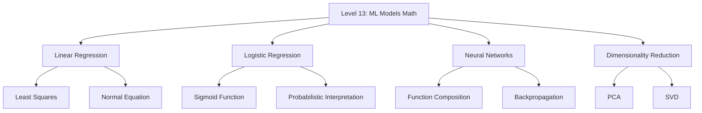

# Level 13: Math Behind Core ML Models

## Overview

Welcome to Level 13, where we bridge the gap between pure mathematics and practical machine learning. This level reveals the mathematical foundations that power the most important machine learning algorithms. Understanding these foundations transforms you from a user of ML libraries into someone who truly comprehends what happens under the hood.

## Why This Level Matters

Every machine learning model is, at its core, a mathematical optimization problem. When you call `model.fit()` in scikit-learn or define a neural network in PyTorch, you're invoking decades of mathematical research in linear algebra, calculus, probability theory, and optimization. This level demystifies these operations.

## Prerequisites

Before diving into this level, you should be comfortable with:

- **Linear Algebra** (Levels 4-5): Matrix operations, eigenvalues, vector spaces
- **Calculus** (Levels 6-7): Derivatives, partial derivatives, gradients, chain rule
- **Probability & Statistics** (Levels 8-9): Probability distributions, maximum likelihood
- **Optimization** (Level 11): Gradient descent, convexity

## Chapter Structure

## Chapters

### Chapter 1: Linear Regression
The foundation of supervised learning. We derive the closed-form solution using matrix calculus and understand why minimizing squared error makes mathematical sense.

**Key Topics:**
- Ordinary Least Squares (OLS)
- The Normal Equation: $\mathbf{w} = (\mathbf{X}^T\mathbf{X})^{-1}\mathbf{X}^T\mathbf{y}$
- Geometric interpretation
- From-scratch implementation

### Chapter 2: Logistic Regression
Classification through the lens of probability. We explore how the sigmoid function transforms linear predictions into probabilities and derive the maximum likelihood objective.

**Key Topics:**
- The Sigmoid (Logistic) Function: $\sigma(z) = \frac{1}{1 + e^{-z}}$
- Log-odds and the logit function
- Cross-entropy loss derivation
- Gradient descent for logistic regression

### Chapter 3: Neural Networks
The mathematics of deep learning. We show how neural networks are compositions of simple functions and derive the backpropagation algorithm from first principles using the chain rule.

**Key Topics:**
- Universal approximation through composition
- Forward pass as matrix operations
- Backpropagation: systematic application of chain rule
- Computing gradients layer by layer

### Chapter 4: Dimensionality Reduction
When data lives in high dimensions but meaning lives in low dimensions. We explore how eigendecomposition and singular value decomposition reveal hidden structure.

**Key Topics:**
- Principal Component Analysis (PCA)
- Singular Value Decomposition (SVD)
- The connection between PCA and SVD
- Variance maximization perspective

## The Mathematical Thread

Throughout these chapters, you'll notice recurring mathematical themes:

| Theme | Linear Regression | Logistic Regression | Neural Networks | PCA/SVD |
|-------|------------------|--------------------|-----------------|---------|
| **Optimization** | Minimize MSE | Maximize likelihood | Minimize loss | Maximize variance |
| **Linear Algebra** | Normal equation | Matrix-vector products | Layer computations | Eigendecomposition |
| **Calculus** | Gradient = 0 | Gradient descent | Backpropagation | First derivatives |
| **Probability** | Gaussian noise | Bernoulli likelihood | - | - |

## Learning Objectives

By the end of this level, you will be able to:

1. **Derive** the normal equation for linear regression from first principles
2. **Explain** why logistic regression uses cross-entropy loss mathematically
3. **Compute** gradients through a neural network by hand
4. **Understand** PCA as both variance maximization and reconstruction minimization
5. **Implement** all four models from scratch using only NumPy

## Notation Guide

| Symbol | Meaning |
|--------|---------|
| $\mathbf{X}$ | Design matrix (features), shape $(n \times d)$ |
| $\mathbf{y}$ | Target vector, shape $(n \times 1)$ |
| $\mathbf{w}$ | Weight vector, shape $(d \times 1)$ |
| $\hat{\mathbf{y}}$ | Predictions |
| $\nabla_\mathbf{w} L$ | Gradient of loss $L$ with respect to weights |
| $\sigma(\cdot)$ | Sigmoid function |
| $\odot$ | Element-wise (Hadamard) product |

## How to Study This Level

1. **Read for intuition first**: Understand what each algorithm is trying to accomplish
2. **Follow the derivations**: Work through the math with pencil and paper
3. **Run the code**: Execute and modify the Python implementations
4. **Solve the exercises**: Test your understanding with the provided problems
5. **Connect the dots**: Notice how ideas from previous levels appear here

## Practical Philosophy

This level emphasizes **deriving from first principles**. Every formula you encounter here can be derived from basic calculus and linear algebra. We don't ask you to memorize - we teach you to derive. This approach:

- Builds deeper understanding
- Enables you to adapt to new situations
- Helps you debug when things go wrong
- Prepares you for research and advanced ML

## Let's Begin

The journey from mathematical theory to working machine learning models starts now. Each chapter builds on the previous, so work through them in order. By the end, you'll have a comprehensive understanding of the mathematics that powers modern AI.

---

*"Machine learning is just math that learned to code."*

**Next Chapter:** [Linear Regression](./01-linear-regression.md)
