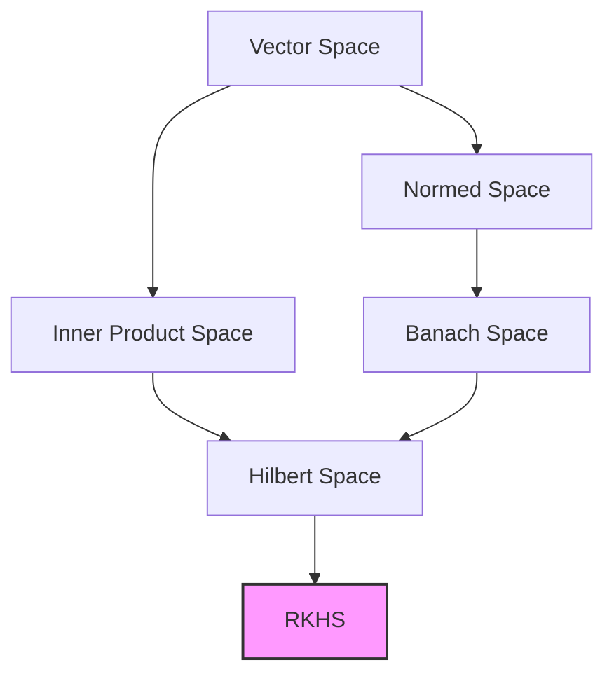
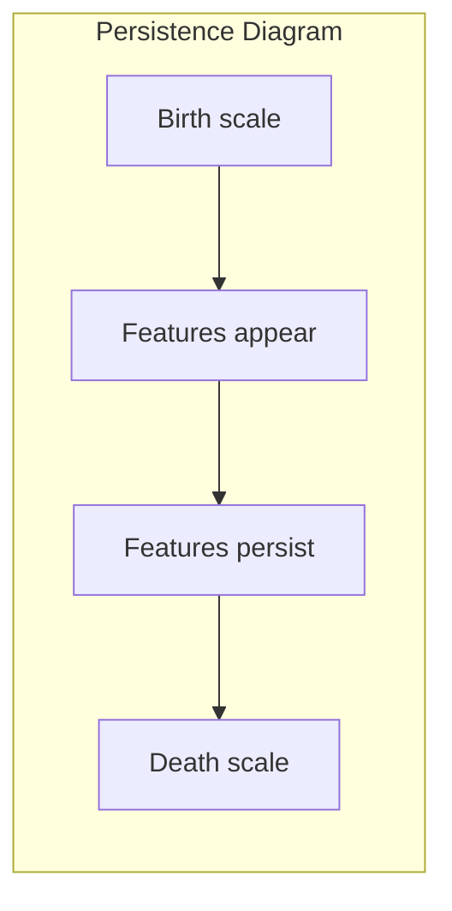
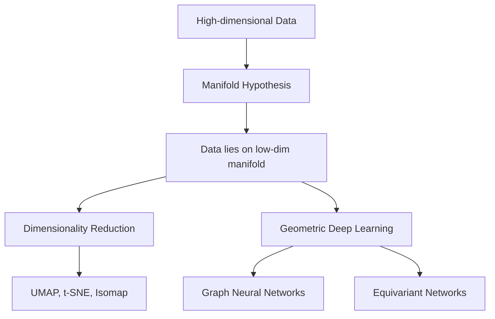
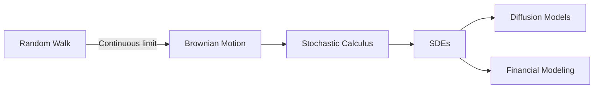
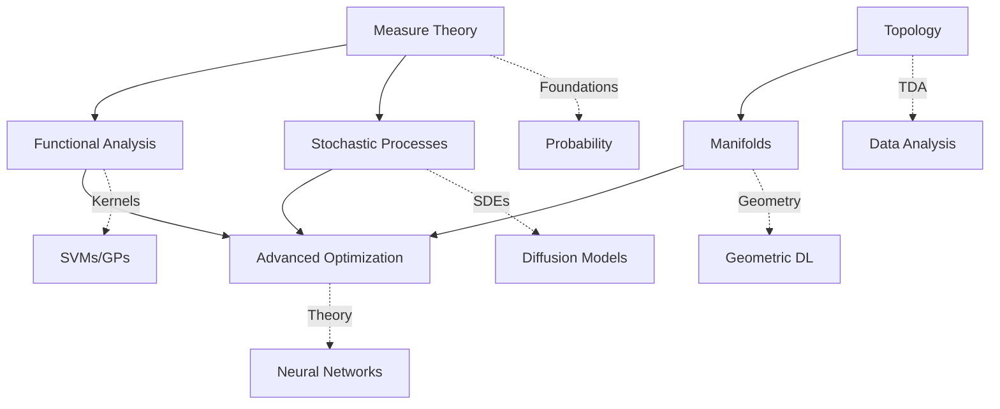

# Advanced Mathematical Topics Reference

## Introduction

This chapter serves as a reference guide to advanced mathematical topics that appear in cutting-edge machine learning research. These subjects represent the theoretical foundations upon which many modern ML innovations are built, from diffusion models to geometric deep learning.

### Why These Topics Matter for Advanced ML Research

As machine learning matures as a field, its theoretical foundations deepen. Researchers increasingly draw from abstract mathematics to:

- **Prove guarantees**: Establish theoretical properties of algorithms (convergence, generalization)
- **Design new architectures**: Create models that respect mathematical structure (symmetries, geometry)
- **Unify frameworks**: Connect disparate methods through common mathematical language
- **Push boundaries**: Develop entirely new approaches grounded in rigorous theory

### When You Might Encounter Them

You will likely encounter these topics when:

- Reading papers from top ML conferences (NeurIPS, ICML, ICLR)
- Working on generative models, especially diffusion-based approaches
- Developing models for non-Euclidean data (graphs, meshes, point clouds)
- Implementing kernel methods or Gaussian processes at scale
- Designing RL algorithms with theoretical guarantees
- Pursuing graduate-level research or coursework

---

## Measure Theory

### What It Is

Measure theory provides the rigorous mathematical foundation for probability theory and integration. While you learned probability using intuitive notions of "probability of an event," measure theory formalizes exactly what we mean by assigning probabilities to sets.

The key insight is that probability is a special case of a more general concept called a "measure" - a systematic way of assigning sizes to sets. Just as length assigns a number to intervals on a line, and area assigns a number to regions in a plane, a measure assigns numbers to sets in abstract spaces.

Why does this matter? Many important probability distributions (like continuous distributions) cannot be rigorously defined without measure theory. When you compute an expectation $\mathbb{E}[X]$, you are actually computing a Lebesgue integral - a type of integral that measure theory makes precise.

### Key Concepts

- **Sigma-algebra ($\sigma$-algebra)**: A collection of sets closed under complements and countable unions
- **Measure**: A function assigning non-negative numbers to sets in a $\sigma$-algebra
- **Probability measure**: A measure where the total measure equals 1
- **Lebesgue measure**: The "standard" measure generalizing length, area, and volume
- **Lebesgue integral**: A more powerful integral than the Riemann integral from calculus
- **Measurable functions**: Functions compatible with the measure-theoretic framework
- **Almost everywhere (a.e.)**: A property that holds except on a set of measure zero

### ML Connections

- **Probability foundations**: Rigorous treatment of continuous probability distributions
- **Density estimation**: Understanding when probability density functions exist (via Radon-Nikodym theorem)
- **Generative models**: Defining distributions over infinite-dimensional spaces
- **Variational inference**: Change of variables formulas and pushforward measures
- **Stochastic calculus**: Foundation for diffusion models and SDEs

### Visual Overview

```
Traditional Probability          Measure-Theoretic View
     (Intuitive)                     (Rigorous)

   P(A) = "probability"    -->   P: F -> [0,1]
   of event A                    (F is a sigma-algebra)

   E[X] = sum or integral  -->   E[X] = integral of X
                                 w.r.t. probability measure

   "continuous distribution" --> Absolutely continuous
                                 w.r.t. Lebesgue measure
```

$$
\text{Expectation: } \mathbb{E}[X] = \int_\Omega X(\omega) \, dP(\omega)
$$

### Further Reading

- **"Probability and Measure"** by Patrick Billingsley - The classic graduate text
- **"Real Analysis and Probability"** by R.M. Dudley - Comprehensive treatment
- **"A Probability Path"** by Sidney Resnick - Accessible introduction

---

## Functional Analysis

### What It Is

Functional analysis extends linear algebra to infinite-dimensional vector spaces. While standard linear algebra deals with vectors in $\mathbb{R}^n$, functional analysis studies spaces of functions, which are inherently infinite-dimensional.

Consider the space of all continuous functions on $[0, 1]$. This is a vector space (you can add functions and multiply by scalars), but it is infinite-dimensional - no finite basis can span all continuous functions. Functional analysis provides the tools to work with such spaces rigorously.

The central objects of study are Banach spaces (complete normed vector spaces) and Hilbert spaces (complete inner product spaces). Hilbert spaces are particularly important in ML because they generalize the familiar geometry of Euclidean space - you can still talk about angles, projections, and orthogonality.

### Key Concepts

- **Normed spaces**: Vector spaces with a notion of length (norm)
- **Banach spaces**: Complete normed spaces (limits of Cauchy sequences exist)
- **Hilbert spaces**: Complete inner product spaces (generalize Euclidean geometry)
- **Bounded linear operators**: Continuous linear maps between Banach spaces
- **Compact operators**: Operators that generalize finite-dimensional linear maps
- **Spectral theory**: Eigenvalue analysis for infinite-dimensional operators
- **Reproducing Kernel Hilbert Spaces (RKHS)**: Hilbert spaces where point evaluation is continuous

### ML Connections

- **Kernel methods**: Support vector machines and Gaussian processes operate in RKHS
- **Neural tangent kernel**: Infinite-width neural networks are described using RKHS theory
- **Regularization**: Many regularizers correspond to RKHS norms
- **Function approximation**: Neural networks as function approximators in Banach spaces
- **Optimal transport**: Wasserstein distances involve functional analysis

### Visual Overview



$$
\text{RKHS Reproducing Property: } f(x) = \langle f, K(\cdot, x) \rangle_{\mathcal{H}}
$$

### Code Taste

```python
import numpy as np
from sklearn.gaussian_process.kernels import RBF

# RKHS in practice: Gaussian Process with RBF kernel
# The RBF kernel defines a Hilbert space of smooth functions

kernel = RBF(length_scale=1.0)

# The kernel k(x, y) represents the inner product
# in the RKHS: k(x, y) = <phi(x), phi(y)>_H
X = np.array([[0], [1], [2]])
K = kernel(X)  # Gram matrix of inner products

print("Kernel matrix (Gram matrix in RKHS):")
print(K)
```

### Further Reading

- **"Introductory Functional Analysis with Applications"** by Kreyszig - Excellent introduction
- **"Functional Analysis"** by Walter Rudin - Rigorous graduate text
- **"Kernel Methods for Pattern Analysis"** by Shawe-Taylor & Cristianini - ML-focused

---

## Topology

### What It Is

Topology studies properties of spaces that are preserved under continuous deformations. While geometry cares about precise measurements (distances, angles), topology cares only about qualitative structure - what is connected to what, how many holes exist, and whether objects can be continuously transformed into each other.

The famous example: a coffee cup and a donut are topologically equivalent (both have one hole), but a sphere and a donut are not. This abstraction may seem far removed from ML, but topology provides powerful tools for understanding the "shape" of data.

Topological Data Analysis (TDA) applies these ideas to extract robust structural features from data. Persistent homology, a key TDA tool, identifies features like connected components and loops that persist across multiple scales.

### Key Concepts

- **Topological space**: A set with a notion of "nearness" (open sets)
- **Continuous functions**: Maps that preserve the topological structure
- **Homeomorphism**: Continuous bijection with continuous inverse (topological equivalence)
- **Connectedness**: Whether a space can be separated into disjoint pieces
- **Compactness**: Generalization of closed and bounded sets
- **Homology**: Algebraic invariants capturing holes in each dimension
- **Persistent homology**: Tracking topological features across scales

### ML Connections

- **Topological Data Analysis (TDA)**: Extracting shape features from point clouds
- **Persistent homology**: Robust feature extraction for noisy data
- **Manifold hypothesis**: The assumption that high-dimensional data lies on low-dimensional manifolds
- **Neural network loss landscapes**: Studying topology of minima and saddle points
- **Coverage and sampling**: Ensuring data covers the underlying space

### Visual Overview

```
Betti Numbers: Counting Holes

b_0 = number of connected components
b_1 = number of 1-dimensional holes (loops)
b_2 = number of 2-dimensional holes (voids)

Examples:
- Circle:    b_0=1, b_1=1, b_2=0
- Sphere:    b_0=1, b_1=0, b_2=1
- Torus:     b_0=1, b_1=2, b_2=1
```



### Code Taste

```python
# Topological Data Analysis with persistent homology
# Using the Ripser library (pip install ripser)

import numpy as np
# from ripser import ripser  # Uncomment with ripser installed

# Generate points on a circle (1-dimensional hole)
theta = np.linspace(0, 2*np.pi, 100)
circle = np.column_stack([np.cos(theta), np.sin(theta)])
circle += 0.1 * np.random.randn(*circle.shape)  # Add noise

# Persistent homology would detect:
# - b_0 = 1 (one connected component)
# - b_1 = 1 (one loop/hole)

# result = ripser(circle, maxdim=1)
# Persistence diagram shows the loop as a long-lived H_1 feature
```

### Further Reading

- **"Computational Topology"** by Edelsbrunner & Harer - Introduction to TDA
- **"Topology"** by Munkres - Classic topology textbook
- **"An Introduction to Topological Data Analysis"** (review paper) - ML-focused overview

---

## Manifolds

### What It Is

A manifold is a space that locally looks like Euclidean space but may have a different global structure. The surface of a sphere is a 2-dimensional manifold: zoom in far enough and it looks flat (like $\mathbb{R}^2$), but globally it curves back on itself.

Differential geometry studies smooth manifolds - manifolds where you can do calculus. This enables defining gradients, optimization, and probability distributions on curved spaces. The mathematics of general relativity (Einstein's theory of gravity) is built on differential geometry.

For ML, manifolds formalize the intuition that high-dimensional data often lies on or near lower-dimensional curved surfaces. This "manifold hypothesis" motivates dimensionality reduction, representation learning, and geometric deep learning.

### Key Concepts

- **Manifold**: Space locally homeomorphic to $\mathbb{R}^n$
- **Smooth manifold**: Manifold with compatible calculus structure
- **Tangent space**: Linear approximation to the manifold at a point
- **Riemannian manifold**: Manifold with a smoothly varying inner product (metric)
- **Geodesic**: Shortest path on a manifold (generalizes straight line)
- **Curvature**: Measures how the manifold deviates from flat space
- **Lie groups**: Manifolds with group structure (symmetries)

### ML Connections

- **Dimensionality reduction**: Manifold learning (UMAP, t-SNE, Isomap)
- **Geometric deep learning**: Neural networks on non-Euclidean domains
- **Optimization on manifolds**: Gradient descent respecting constraints
- **Normalizing flows**: Transformations preserving manifold structure
- **Equivariant networks**: Architectures respecting symmetries (Lie groups)
- **Hyperbolic embeddings**: Representing hierarchical data in hyperbolic space

### Visual Overview

$$
\text{Tangent Space at } p: \quad T_pM \approx \mathbb{R}^n
$$

```
        Manifold M
           /\
          /  \
         /    \  <-- Curved globally
        /______\
           |
           | Local chart (looks like R^n)
           v
        [____|____]
         -1  0  1   <- Euclidean coordinates
```



### Code Taste

```python
import numpy as np

# Optimization on the sphere manifold
# Gradient descent that stays on the unit sphere

def project_to_sphere(x):
    """Project point onto unit sphere"""
    return x / np.linalg.norm(x)

def riemannian_gradient(euclidean_grad, x):
    """Project Euclidean gradient to tangent space of sphere"""
    # Tangent space at x is orthogonal to x
    return euclidean_grad - np.dot(euclidean_grad, x) * x

def objective(x):
    """Simple objective: maximize x[0]"""
    return -x[0]  # Negative for minimization

def euclidean_gradient(x):
    """Gradient of objective"""
    grad = np.zeros_like(x)
    grad[0] = -1
    return grad

# Riemannian gradient descent
x = project_to_sphere(np.random.randn(3))
lr = 0.1

for i in range(100):
    grad = euclidean_gradient(x)
    riem_grad = riemannian_gradient(grad, x)
    x = x - lr * riem_grad
    x = project_to_sphere(x)  # Retraction to manifold

print(f"Optimum on sphere: {x}")  # Should approach [1, 0, 0]
```

### Further Reading

- **"Introduction to Smooth Manifolds"** by John Lee - Comprehensive graduate text
- **"Riemannian Geometry and Geometric Analysis"** by Jost - Connects to analysis
- **"An Introduction to Optimization on Smooth Manifolds"** by Boumal - ML-relevant

---

## Advanced Optimization

### What It Is

While Level 9 covered convex optimization, many ML problems are inherently non-convex. Training neural networks, for instance, involves optimizing non-convex loss landscapes with potentially exponentially many local minima and saddle points.

Advanced optimization extends beyond convex analysis to handle these challenging settings. This includes understanding the geometry of non-convex landscapes, developing algorithms with convergence guarantees in non-convex settings, and studying specialized problem structures like bilevel optimization.

Recent theoretical advances have shown that despite non-convexity, gradient descent often succeeds in practice due to favorable geometric properties of common loss landscapes.

### Key Concepts

- **Non-convex optimization**: Optimization without convexity guarantees
- **Saddle points**: Critical points that are neither minima nor maxima
- **Loss landscape analysis**: Studying geometry of neural network objectives
- **Bilevel optimization**: Optimization problems nested within other optimization problems
- **Constrained optimization**: Optimization with equality/inequality constraints
- **Lagrangian duality**: Reformulating constrained problems
- **KKT conditions**: Necessary conditions for optimality
- **Semi-definite programming (SDP)**: Optimization over positive semi-definite matrices

### ML Connections

- **Neural network training**: Understanding why gradient descent works
- **Hyperparameter optimization**: Bilevel optimization formulation
- **Neural architecture search**: Discrete-continuous optimization
- **Adversarial training**: Min-max optimization problems
- **Meta-learning**: Learning to learn as bilevel optimization
- **Constrained learning**: Fair ML, physics-informed networks

### Visual Overview

$$
\text{Bilevel Optimization:} \quad \min_{x} F(x, y^*(x)) \quad \text{where} \quad y^*(x) = \arg\min_{y} f(x, y)
$$

```
Non-convex Loss Landscape:

     Loss
       ^
       |    /\      /\
       |   /  \    /  \    /
       |  /    \  /    \/\/  <- Local minima, saddle points
       | /      \/
       |/
       +----------------------> Parameters

Unlike convex: multiple local minima, saddle points
But: gradient descent often finds good solutions anyway
```

### Code Taste

```python
import numpy as np

# Simple bilevel optimization example
# Outer: minimize (x - y*)^2
# Inner: y* = argmin_y (y - 2x)^2, so y* = 2x

def inner_objective(y, x):
    return (y - 2*x)**2

def outer_objective(x, y_star):
    return (x - y_star)**2

def solve_inner(x, lr=0.1, steps=100):
    """Solve inner optimization for given x"""
    y = np.random.randn()
    for _ in range(steps):
        grad = 2 * (y - 2*x)
        y = y - lr * grad
    return y

def hypergradient(x, y_star):
    """Compute gradient of outer objective w.r.t. x
    Using implicit differentiation: dy*/dx = 2
    d/dx[(x - y*)^2] = 2(x - y*)(1 - dy*/dx) = 2(x - y*)(1 - 2)
    """
    return 2 * (x - y_star) * (1 - 2)

# Bilevel gradient descent
x = 1.0
for i in range(50):
    y_star = solve_inner(x)
    grad = hypergradient(x, y_star)
    x = x - 0.1 * grad

print(f"Optimal x: {x}, y*: {solve_inner(x)}")  # x -> 0
```

### Further Reading

- **"Convex Optimization"** by Boyd & Vandenberghe - Foundation (free online)
- **"Nonlinear Programming"** by Bertsekas - Comprehensive treatment
- **"Bilevel Optimization: Theory, Algorithms, Applications"** - Survey paper

---

## Stochastic Processes

### What It Is

A stochastic process is a collection of random variables indexed by time (or space). While probability theory studies individual random variables, stochastic processes study how randomness evolves. Think of a random walk: at each time step, the position is random, but there are dependencies and structure across time.

Different types of stochastic processes capture different types of randomness:
- **Markov processes**: Future depends only on present (memoryless)
- **Martingales**: No expected gain or loss (fair games)
- **Brownian motion**: Continuous-time limit of random walks
- **Poisson processes**: Counting random events over time

Stochastic calculus extends calculus to handle these random processes, enabling the analysis of stochastic differential equations (SDEs) that describe systems with continuous random inputs.

### Key Concepts

- **Stochastic process**: Collection of random variables $\{X_t : t \in T\}$
- **Markov property**: Future independent of past given present
- **Martingale**: No expected change: $\mathbb{E}[X_{t+1} | X_t] = X_t$
- **Brownian motion**: Continuous Gaussian process with independent increments
- **Ito calculus**: Calculus for stochastic integrals
- **Stochastic differential equations (SDEs)**: Differential equations with noise
- **Fokker-Planck equation**: PDE describing probability distribution evolution

### ML Connections

- **Diffusion models**: DDPM, score matching based on SDEs
- **Reinforcement learning**: MDPs are discrete-time Markov processes
- **Time series**: ARIMA, state space models as stochastic processes
- **Bayesian optimization**: Gaussian processes for sequential optimization
- **MCMC**: Markov chains for sampling from posteriors
- **Stochastic gradient descent**: Analysis using stochastic process theory

### Visual Overview

$$
\text{SDE (Ito form):} \quad dX_t = \mu(X_t, t)\,dt + \sigma(X_t, t)\,dW_t
$$

```
Diffusion Model as SDE:

Forward (add noise):
   Clean Image  ──────────────────────>  Pure Noise
       x_0          dx = -x dt + dW          x_T

Reverse (denoise):
   Pure Noise   ──────────────────────>  Clean Image
       x_T       dx = [x + 2s(x,t)]dt       x_0
                      (learned score)
```



### Code Taste

```python
import numpy as np
import matplotlib.pyplot as plt

# Simulate an Ornstein-Uhlenbeck process
# dX = -theta * X * dt + sigma * dW
# This is the foundation of diffusion models

theta = 1.0   # Mean reversion strength
sigma = 0.5   # Noise strength
dt = 0.01     # Time step
T = 10.0      # Total time
n_steps = int(T / dt)

# Euler-Maruyama discretization
X = np.zeros(n_steps)
X[0] = 2.0  # Initial condition

for i in range(1, n_steps):
    dW = np.sqrt(dt) * np.random.randn()
    X[i] = X[i-1] - theta * X[i-1] * dt + sigma * dW

# The process reverts to mean 0 with fluctuations
print(f"Final value: {X[-1]:.3f}")
print(f"Mean of second half: {X[n_steps//2:].mean():.3f}")

# plt.plot(np.linspace(0, T, n_steps), X)
# plt.xlabel('Time'); plt.ylabel('X'); plt.title('Ornstein-Uhlenbeck Process')
```

### Further Reading

- **"Stochastic Calculus for Finance II"** by Shreve - Accessible introduction
- **"Stochastic Differential Equations"** by Oksendal - Standard graduate text
- **"Score-Based Generative Modeling through SDEs"** - Foundational diffusion model paper

---

## Summary

### Quick Reference: When Each Topic is Relevant

| Topic | You Need It When... | You Can Probably Skip If... |
|-------|--------------------|-----------------------------|
| **Measure Theory** | Proving theoretical results about continuous distributions, working with infinite-dimensional probability | Using standard probability tools, applied ML work |
| **Functional Analysis** | Developing kernel methods, understanding RKHS theory, infinite-width neural network theory | Using kernels as black boxes, standard deep learning |
| **Topology** | Applying TDA to data, studying loss landscape structure, theoretical manifold learning | Using standard dimensionality reduction tools |
| **Manifolds** | Geometric deep learning, optimization on constrained spaces, hyperbolic embeddings | Standard Euclidean ML problems |
| **Advanced Optimization** | Analyzing neural network training theory, hyperparameter optimization research, constrained ML | Using off-the-shelf optimizers |
| **Stochastic Processes** | Developing diffusion models, RL theory, time series from first principles | Using existing implementations |

### Relationship Between Topics



### Final Advice

1. **Learn on demand**: Do not try to master all these topics at once. Learn what you need when you need it.

2. **Recognize patterns**: Being able to identify "this is a manifold learning problem" or "this involves stochastic calculus" is valuable even without deep expertise.

3. **Follow the math**: When papers reference these topics, trace back to understand why - this builds intuition.

4. **Stay practical**: Many successful ML practitioners have limited exposure to these topics. Depth should follow necessity.

5. **Embrace the journey**: If you find yourself drawn to these subjects, enjoy the exploration. Mathematics is beautiful, and these topics represent some of humanity's greatest intellectual achievements.

---

## Resources for Further Study

### Online Courses
- MIT OpenCourseWare: Analysis I, II (measure theory foundations)
- Stanford EE364a: Convex Optimization (Boyd, free online)
- Various universities: Functional Analysis courses on YouTube

### Books (Progressive Difficulty)
1. **Bridge level**: "All of Statistics" by Wasserman
2. **Graduate intro**: "Probability and Measure" by Billingsley
3. **Advanced**: Original papers and specialized monographs

### Communities
- Mathematics Stack Exchange for concept questions
- Cross Validated for statistics applications
- ML research communities (Twitter/X, Reddit r/MachineLearning) for recent applications

---

*This reference guide provides entry points to advanced mathematics for ML researchers. For rigorous understanding, follow the reading recommendations and consider formal coursework. Remember: mathematical maturity is built gradually through sustained engagement with challenging material.*
