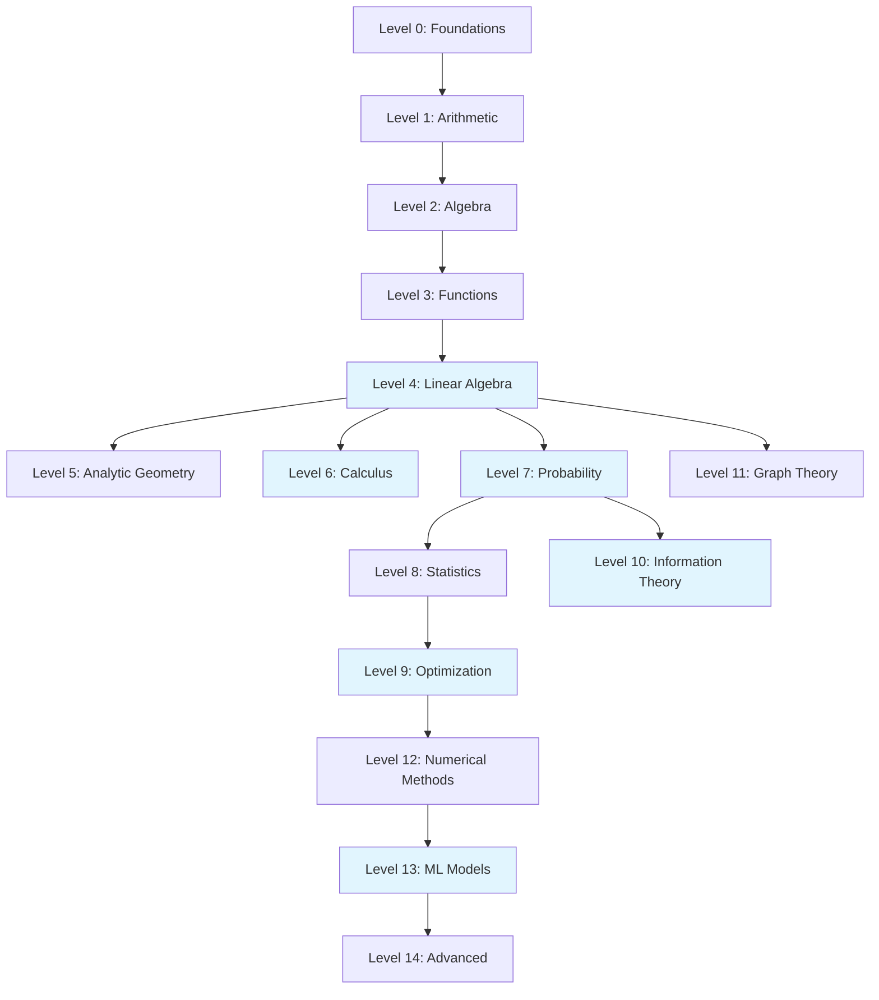

# Mathematics for Machine Learning

> A complete mathematical foundation for software engineers.

---

## Quick Start

```bash
pip install numpy scipy matplotlib
```

**New to math?** Start at [Level 0: Mathematical Foundations](00-level-0-foundations/README.md)

**Refreshing?** Jump to any topic in the [Table of Contents](#table-of-contents)

**ML-focused?** Prioritize Levels 4, 6-10, and 13

---

## Why This Book

| Feature | Description |
|---------|-------------|
| **Code-first** | Every concept includes working Python examples |
| **ML-focused** | Theory tied directly to machine learning applications |
| **Visual** | Mermaid diagrams + LaTeX formulas |
| **Progressive** | 15 levels from basics to advanced |

---

## Learning Path



*Highlighted levels are most critical for ML.*

---

## Chapter Format

Each chapter follows this structure:

1. **Intuition** — Plain English + analogies
2. **Visual Explanation** — Diagrams and formulas
3. **Mathematical Foundation** — Definitions and derivations
4. **Code Example** — Python implementation
5. **ML Relevance** — Real-world applications
6. **When to Use / Ignore** — Practical guidance
7. **Exercises** — Problems with solutions
8. **Summary** — Key takeaways

---

## Table of Contents

### Level 0: Mathematical Foundations
| Chapter | Topic |
|---------|-------|
| 0.1 | [Mathematical Language](00-level-0-foundations/01-mathematical-language.md) |
| 0.2 | [Sets & Logic](00-level-0-foundations/02-sets-and-logic.md) |
| 0.3 | [Mathematical Thinking](00-level-0-foundations/03-mathematical-thinking.md) |

### Level 1: Arithmetic & Numbers
| Chapter | Topic |
|---------|-------|
| 1.1 | [Number Systems](01-level-1-arithmetic/01-number-systems.md) |
| 1.2 | [Arithmetic Operations](01-level-1-arithmetic/02-arithmetic-operations.md) |
| 1.3 | [Ratios & Scales](01-level-1-arithmetic/03-ratios-and-scales.md) |

### Level 2: Algebra
| Chapter | Topic |
|---------|-------|
| 2.1 | [Variables & Expressions](02-level-2-algebra/01-variables-and-expressions.md) |
| 2.2 | [Linear Equations](02-level-2-algebra/02-linear-equations.md) |
| 2.3 | [Polynomials](02-level-2-algebra/03-polynomials.md) |
| 2.4 | [Exponentials & Logarithms](02-level-2-algebra/04-exponentials-and-logarithms.md) |
| 2.5 | [Inequalities](02-level-2-algebra/05-inequalities.md) |

### Level 3: Functions
| Chapter | Topic |
|---------|-------|
| 3.1 | [Functions](03-level-3-functions/01-functions.md) |
| 3.2 | [Common Function Types](03-level-3-functions/02-common-function-types.md) |
| 3.3 | [Multivariable Functions](03-level-3-functions/03-multivariable-functions.md) |

### Level 4: Linear Algebra
| Chapter | Topic |
|---------|-------|
| 4.1 | [Vectors](04-level-4-linear-algebra/01-vectors.md) |
| 4.2 | [Geometry of Vectors](04-level-4-linear-algebra/02-geometry-of-vectors.md) |
| 4.3 | [Matrices](04-level-4-linear-algebra/03-matrices.md) |
| 4.4 | [Matrix as Transformation](04-level-4-linear-algebra/04-matrix-as-transformation.md) |
| 4.5 | [Systems of Linear Equations](04-level-4-linear-algebra/05-systems-of-linear-equations.md) |
| 4.6 | [Eigenvalues & Eigenvectors](04-level-4-linear-algebra/06-eigenvalues-and-eigenvectors.md) |
| 4.7 | [Decompositions](04-level-4-linear-algebra/07-decompositions.md) |

### Level 5: Analytic Geometry
| Chapter | Topic |
|---------|-------|
| 5.1 | [Coordinate Systems](05-level-5-analytic-geometry/01-coordinate-systems.md) |
| 5.2 | [Distance Metrics](05-level-5-analytic-geometry/02-distance-metrics.md) |

### Level 6: Calculus
| Chapter | Topic |
|---------|-------|
| 6.1 | [Limits](06-level-6-calculus/01-limits.md) |
| 6.2 | [Derivatives](06-level-6-calculus/02-derivatives.md) |
| 6.3 | [Gradients](06-level-6-calculus/03-gradients.md) |
| 6.4 | [Optimization](06-level-6-calculus/04-optimization.md) |
| 6.5 | [Integral Calculus](06-level-6-calculus/05-integral-calculus.md) |

### Level 7: Probability Theory
| Chapter | Topic |
|---------|-------|
| 7.1 | [Probability Foundations](07-level-7-probability/01-probability-foundations.md) |
| 7.2 | [Conditional Probability](07-level-7-probability/02-conditional-probability.md) |
| 7.3 | [Random Variables](07-level-7-probability/03-random-variables.md) |
| 7.4 | [Expectation & Moments](07-level-7-probability/04-expectation-and-moments.md) |
| 7.5 | [Common Distributions](07-level-7-probability/05-common-distributions.md) |

### Level 8: Statistics
| Chapter | Topic |
|---------|-------|
| 8.1 | [Descriptive Statistics](08-level-8-statistics/01-descriptive-statistics.md) |
| 8.2 | [Sampling Theory](08-level-8-statistics/02-sampling-theory.md) |
| 8.3 | [Estimation](08-level-8-statistics/03-estimation.md) |
| 8.4 | [Hypothesis Testing](08-level-8-statistics/04-hypothesis-testing.md) |

### Level 9: Optimization Theory
| Chapter | Topic |
|---------|-------|
| 9.1 | [Loss Functions](09-level-9-optimization-theory/01-loss-functions.md) |
| 9.2 | [Optimization Algorithms](09-level-9-optimization-theory/02-optimization-algorithms.md) |
| 9.3 | [Convex Optimization](09-level-9-optimization-theory/03-convex-optimization.md) |
| 9.4 | [Regularization](09-level-9-optimization-theory/04-regularization.md) |

### Level 10: Information Theory
| Chapter | Topic |
|---------|-------|
| 10.1 | [Information](10-level-10-information-theory/01-information.md) |
| 10.2 | [Entropy](10-level-10-information-theory/02-entropy.md) |
| 10.3 | [Cross-Entropy](10-level-10-information-theory/03-cross-entropy.md) |
| 10.4 | [KL Divergence](10-level-10-information-theory/04-kl-divergence.md) |

### Level 11: Graph Theory
| Chapter | Topic |
|---------|-------|
| 11.1 | [Graph Basics](11-level-11-graph-theory/01-graph-basics.md) |
| 11.2 | [Graph Properties](11-level-11-graph-theory/02-graph-properties.md) |
| 11.3 | [Graph Algorithms](11-level-11-graph-theory/03-graph-algorithms.md) |

### Level 12: Numerical Methods
| Chapter | Topic |
|---------|-------|
| 12.1 | [Numerical Stability](12-level-12-numerical-methods/01-numerical-stability.md) |
| 12.2 | [Approximation](12-level-12-numerical-methods/02-approximation.md) |
| 12.3 | [Optimization in Practice](12-level-12-numerical-methods/03-optimization-in-practice.md) |

### Level 13: ML Models Math
| Chapter | Topic |
|---------|-------|
| 13.1 | [Linear Regression](13-level-13-ml-models-math/01-linear-regression.md) |
| 13.2 | [Logistic Regression](13-level-13-ml-models-math/02-logistic-regression.md) |
| 13.3 | [Neural Networks](13-level-13-ml-models-math/03-neural-networks.md) |
| 13.4 | [Dimensionality Reduction](13-level-13-ml-models-math/04-dimensionality-reduction.md) |

### Level 14: Advanced Topics
| Chapter | Topic |
|---------|-------|
| 14.1 | [Advanced Topics Reference](14-level-14-advanced/01-advanced-topics-reference.md) |

---

## Prerequisites

- Basic programming experience
- Python 3.x installed
- Curiosity about mathematics

---

## Appendix: Recommended Reading

### Foundational Mathematics

| Book | Author | Best For |
|------|--------|----------|
| *How to Solve It* | George Pólya | Mathematical thinking and problem-solving |
| *Book of Proof* | Richard Hammack | Logic, sets, and proof techniques (free online) |
| *Mathematics for Computer Science* | Lehman, Leighton, Meyer | Discrete math for programmers (MIT OpenCourseWare) |

### Linear Algebra

| Book | Author | Best For |
|------|--------|----------|
| *Linear Algebra Done Right* | Sheldon Axler | Conceptual understanding, theory-focused |
| *Introduction to Linear Algebra* | Gilbert Strang | Practical, computational approach |
| *Coding the Matrix* | Philip Klein | Linear algebra through Python programming |
| *Linear Algebra and Its Applications* | David Lay | Standard undergraduate text |

### Calculus

| Book | Author | Best For |
|------|--------|----------|
| *Calculus* | Michael Spivak | Rigorous foundations |
| *Calculus Made Easy* | Silvanus Thompson | Intuitive, beginner-friendly |
| *Active Calculus* | Matt Boelkins | Free, activity-based learning |

### Probability & Statistics

| Book | Author | Best For |
|------|--------|----------|
| *Introduction to Probability* | Blitzstein & Hwang | Intuitive probability (Harvard course) |
| *Think Stats* | Allen Downey | Statistics for programmers (free online) |
| *All of Statistics* | Larry Wasserman | Concise graduate-level reference |
| *Statistical Inference* | Casella & Berger | Rigorous statistical theory |

### Machine Learning Mathematics

| Book | Author | Best For |
|------|--------|----------|
| *Mathematics for Machine Learning* | Deisenroth, Faisal, Ong | **Best overall ML math book** (free PDF) |
| *The Matrix Calculus You Need for Deep Learning* | Parr & Howard | Derivatives and gradients for neural networks (free) |
| *Deep Learning* | Goodfellow, Bengio, Courville | Math foundations in Part I (free online) |
| *Pattern Recognition and Machine Learning* | Christopher Bishop | Probabilistic ML, Bayesian methods |

### Optimization

| Book | Author | Best For |
|------|--------|----------|
| *Convex Optimization* | Boyd & Vandenberghe | Definitive optimization text (free PDF) |
| *Numerical Optimization* | Nocedal & Wright | Practical optimization algorithms |

### Information Theory

| Book | Author | Best For |
|------|--------|----------|
| *Elements of Information Theory* | Cover & Thomas | Standard reference |
| *Information Theory, Inference, and Learning Algorithms* | David MacKay | ML perspective (free online) |

### Advanced Topics

| Book | Author | Best For |
|------|--------|----------|
| *Analysis I & II* | Terence Tao | Rigorous real analysis |
| *Topology* | James Munkres | Foundational topology |
| *Stochastic Processes* | Sheldon Ross | Random processes for ML |

---

### Free Online Resources

| Resource | URL | Topics |
|----------|-----|--------|
| 3Blue1Brown | youtube.com/3blue1brown | Visual math intuition |
| Khan Academy | khanacademy.org | All foundational topics |
| MIT OpenCourseWare | ocw.mit.edu | University-level courses |
| Paul's Online Math Notes | tutorial.math.lamar.edu | Calculus reference |
| Seeing Theory | seeing-theory.brown.edu | Interactive probability |

---

### Suggested Learning Paths

**Minimal ML Path** (fastest route):
1. *Mathematics for Machine Learning* (Deisenroth) — covers essentials
2. *Deep Learning* Part I (Goodfellow) — fills gaps

**Rigorous Path** (deep understanding):
1. *Book of Proof* (Hammack) — foundations
2. *Linear Algebra Done Right* (Axler) — theory
3. *Introduction to Probability* (Blitzstein) — probability
4. *Convex Optimization* (Boyd) — optimization
5. *Pattern Recognition and Machine Learning* (Bishop) — synthesis

**Programmer's Path** (code-first):
1. *Coding the Matrix* (Klein) — linear algebra
2. *Think Stats* (Downey) — statistics
3. *Mathematics for Machine Learning* (Deisenroth) — ML math

---

## License

Educational use.
